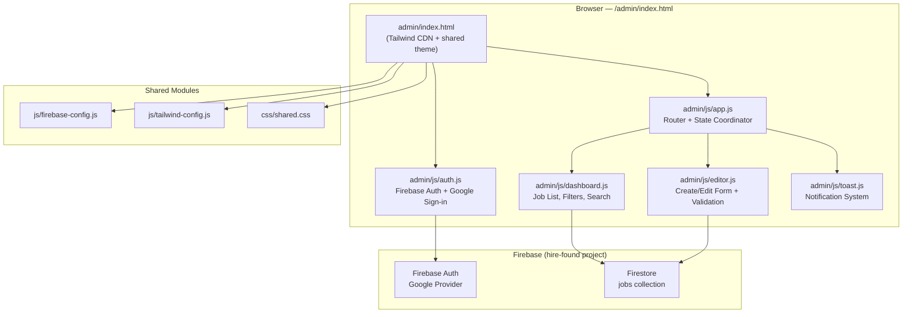

# Design Document: Admin Job Panel

## Overview

The Admin Job Panel is a private, single-page admin interface at `/admin/index.html` for Yasmin to manage HireFound job posts. It integrates Firebase Authentication (Google sign-in) as an access gate and provides full CRUD operations against the Firestore `jobs` collection. The panel reuses the existing HireFound design system (Tailwind CSS theme, glassmorphism, premium-card patterns) and follows the project's vanilla JS ES module architecture with CDN imports — no build step required.

The panel operates as a standalone page within the static site, sharing the Firebase project configuration and Tailwind theme but maintaining its own authentication layer and admin-specific UI components.

## Architecture



### Key Architectural Decisions

1. **Single HTML page with view switching** — The admin panel uses a single `index.html` with JS-driven view toggling (sign-in → dashboard → editor) rather than multiple HTML files. This simplifies auth state management and avoids page reload flicker.

2. **Extended firebase-config.js** — The existing `js/firebase-config.js` will be extended to also export the Firebase Auth instance alongside the Firestore `db`. This keeps Firebase initialization centralized.

3. **Admin-specific JS modules in `/admin/js/`** — All admin logic lives in its own directory to maintain separation from the public site. Modules use the same CDN ESM import pattern.

4. **Client-side auth guard only** — Since this is a static site on GitHub Pages, the auth guard is client-side. Firestore Security Rules provide the actual server-side enforcement (only the allowed UID can write to the `jobs` collection).

5. **No build step** — Consistent with the rest of the project, all JS uses CDN ESM imports from `gstatic.com/firebasejs/`.

## Components and Interfaces

### 1. Firebase Config Extension (`js/firebase-config.js`)

The existing module is extended to export `auth` and `app` alongside `db`:

```javascript
// Added exports
export { app, db, auth };
```

### 2. Auth Guard Module (`admin/js/auth.js`)

Manages authentication state and access control.

**Exports:**
```javascript
/**
 * Initializes auth state listener and renders appropriate view.
 * @param {Object} config
 * @param {string} config.allowedEmail - The single permitted email address
 * @param {HTMLElement} config.signInContainer - Element for sign-in UI
 * @param {HTMLElement} config.appContainer - Element for authenticated content
 * @param {HTMLElement} config.loadingContainer - Element for loading state
 * @param {Function} config.onAuthenticated - Callback when user is verified
 * @param {Function} config.onSignedOut - Callback when user signs out
 */
export function initAuth(config): void

/** Signs the current user out and resets UI. */
export function signOut(): Promise<void>

/** Returns the current authenticated user or null. */
export function getCurrentUser(): User | null
```

### 3. Dashboard Module (`admin/js/dashboard.js`)

Renders the job list with filtering, search, and action buttons.

**Exports:**
```javascript
/**
 * Initializes the dashboard view.
 * @param {HTMLElement} container - The dashboard container element
 * @param {Object} callbacks
 * @param {Function} callbacks.onEdit - Called with job doc when edit is clicked
 * @param {Function} callbacks.onDelete - Called with job doc when delete is clicked
 * @param {Function} callbacks.onToggleActive - Called with job doc when toggle is clicked
 * @param {Function} callbacks.onNewJob - Called when "New Job" button is clicked
 */
export function initDashboard(container, callbacks): void

/** Refreshes the job list from Firestore. */
export function refreshJobs(): Promise<void>

/** Updates a single job card in the list without full refresh. */
export function updateJobCard(jobId, data): void

/** Removes a job card from the list with exit animation. */
export function removeJobCard(jobId): void
```

### 4. Editor Module (`admin/js/editor.js`)

Handles the create/edit form with validation and slug generation.

**Exports:**
```javascript
/**
 * Opens the editor in create mode with empty fields.
 * @param {HTMLElement} container - The editor container element
 * @param {Object} callbacks
 * @param {Function} callbacks.onSave - Called with form data on successful validation
 * @param {Function} callbacks.onCancel - Called when cancel is clicked
 */
export function openCreateEditor(container, callbacks): void

/**
 * Opens the editor in edit mode with pre-populated fields.
 * @param {HTMLElement} container - The editor container element
 * @param {Object} jobData - Existing job document data
 * @param {string} jobId - Firestore document ID
 * @param {Object} callbacks
 * @param {Function} callbacks.onSave - Called with updated form data
 * @param {Function} callbacks.onCancel - Called when cancel is clicked
 */
export function openEditEditor(container, jobData, jobId, callbacks): void

/**
 * Generates a URL-safe slug from a title string.
 * @param {string} title - The title to slugify
 * @returns {string} The generated slug (max 80 chars)
 */
export function generateSlug(title): string

/**
 * Validates all form fields and returns validation result.
 * @param {Object} formData - The form field values
 * @returns {{ valid: boolean, errors: Record<string, string> }}
 */
export function validateForm(formData): ValidationResult
```

### 5. Toast Module (`admin/js/toast.js`)

Provides animated notification messages.

**Exports:**
```javascript
/**
 * Shows a toast notification.
 * @param {Object} options
 * @param {'success' | 'error'} options.type - Toast variant
 * @param {string} options.message - Display message
 * @param {number} [options.duration=5000] - Auto-dismiss time in ms
 */
export function showToast(options): void
```

### 6. App Coordinator (`admin/js/app.js`)

Orchestrates views, handles routing between dashboard and editor, and coordinates Firestore operations.

**Exports:**
```javascript
/** Entry point — initializes auth, then dashboard on success. */
export function initApp(): void
```

## Data Models

### Firestore Document: `jobs/{docId}`

| Field | Type | Constraints | Required |
|-------|------|-------------|----------|
| title | string | 1–120 characters | Yes |
| titleAr | string | 0–120 characters | No |
| slug | string | lowercase alphanumeric + hyphens, max 80 chars, unique | Yes |
| category | string | enum: hospitality, tech, fnb, aviation, other | Yes |
| location | string | 1–100 characters | Yes |
| employmentType | string | enum: full-time, part-time, contract, freelance | Yes |
| shortDescription | string | 0–300 characters | No |
| fullDescription | string | unlimited | No |
| fullDescriptionAr | string | unlimited | No |
| companyName | string | 0–120 characters | No |
| salary | string | 0–100 characters | No |
| contactWhatsApp | string | digits only, 7–15 characters | No |
| contactEmail | string | valid email format | No |
| tallyFormId | string | — | No |
| createdAt | Timestamp | server-generated on create, immutable | Yes |
| isActive | boolean | defaults to true on create | Yes |

### Form Validation Rules

```javascript
const VALIDATION_RULES = {
  title:          { required: true, minLength: 1, maxLength: 120 },
  titleAr:        { required: false, maxLength: 120 },
  slug:           { required: true, pattern: /^[a-z0-9]+(-[a-z0-9]+)*$/, maxLength: 80 },
  category:       { required: true, enum: ['hospitality', 'tech', 'fnb', 'aviation', 'other'] },
  location:       { required: true, minLength: 1, maxLength: 100 },
  employmentType: { required: true, enum: ['full-time', 'part-time', 'contract', 'freelance'] },
  shortDescription: { required: false, maxLength: 300 },
  companyName:    { required: false, maxLength: 120 },
  salary:         { required: false, maxLength: 100 },
  contactWhatsApp: { required: false, pattern: /^\d{7,15}$/ },
  contactEmail:   { required: false, pattern: /^[^\s@]+@[^\s@]+\.[^\s@]+$/ },
};
```

### Slug Generation Algorithm

```
1. Input: title string
2. Convert to lowercase
3. Replace spaces and non-alphanumeric characters with hyphens
4. Collapse consecutive hyphens into a single hyphen
5. Strip leading and trailing hyphens
6. Truncate to 80 characters
7. If slug exists in Firestore, append "-2", "-3", etc. until unique
```

### Auth Configuration

```javascript
const AUTH_CONFIG = {
  allowedEmail: 'yasmin@hirefound.com',  // Single permitted user
  persistence: 'LOCAL',                   // Survives browser restart
  provider: 'google.com',                // Google sign-in only
  autoSignOutDelay: 3000,                // ms before signing out unauthorized users
};
```

## Correctness Properties

*A property is a characteristic or behavior that should hold true across all valid executions of a system — essentially, a formal statement about what the system should do. Properties serve as the bridge between human-readable specifications and machine-verifiable correctness guarantees.*

### Property 1: Auth email rejection

*For any* email string that is not equal to the configured allowed email, the auth check function SHALL return a "denied" result, regardless of the email's format, domain, or content.

**Validates: Requirements 1.2**

### Property 2: Job card rendering completeness

*For any* valid Job_Post object, the rendered card HTML SHALL contain the job's title, category badge text, location, employment type, company name, and an active/inactive status indicator.

**Validates: Requirements 2.2**

### Property 3: Combined filter correctness

*For any* list of Job_Post objects and any combination of search text, category filter, and status filter, the filtered result SHALL contain only jobs that satisfy ALL active filter conditions simultaneously, and the reported count SHALL equal the length of the filtered result array.

**Validates: Requirements 2.3, 2.4, 2.5, 2.6, 2.7**

### Property 4: Form validation rejects invalid data

*For any* form data object where at least one required field (title, category, location, employmentType) is missing or invalid, or where an optional field (contactWhatsApp, contactEmail) contains a value violating its format constraint, the validation function SHALL return `valid: false` with an error entry for each invalid field.

**Validates: Requirements 3.2, 3.8, 4.2, 4.3, 8.4**

### Property 5: Slug generation structural invariants

*For any* non-empty title string, the generated slug SHALL: (a) contain only lowercase alphanumeric characters and hyphens, (b) not start or end with a hyphen, (c) not contain consecutive hyphens, and (d) have a length of at most 80 characters.

**Validates: Requirements 3.5, 8.5**

### Property 6: Slug deduplication uniqueness

*For any* base slug and any set of existing slugs in Firestore, the deduplication function SHALL return a slug that is not present in the existing set while preserving the base slug as a prefix.

**Validates: Requirements 3.7**

### Property 7: Time-of-day greeting correctness

*For any* hour value from 0 to 23, the greeting function SHALL return "Good morning" for hours 5–11, "Good afternoon" for hours 12–16, and "Good evening" for hours 17–23 and 0–4.

**Validates: Requirements 7.3**

## Error Handling

### Authentication Errors

| Error Scenario | Handling |
|---|---|
| Firebase Auth fails to initialize | Show error screen with "Authentication unavailable" message and retry button |
| Google sign-in popup blocked | Show toast with instructions to allow popups |
| Network error during sign-in | Show error toast, preserve sign-in screen for retry |
| Unauthorized email signs in | Show "Access Denied" message, auto sign-out after 3 seconds |
| Session token expires while panel is open | Detect via `onAuthStateChanged`, redirect to sign-in within 5 seconds |

### Firestore Operation Errors

| Error Scenario | Handling |
|---|---|
| Job list fetch fails or times out (>10s) | Show error state with retry button in dashboard area |
| Create job write fails | Show error toast, preserve form data for retry |
| Edit job update fails | Show error toast, re-enable submit button, preserve form data |
| Toggle isActive fails or times out (>10s) | Revert toggle to previous position, show error toast |
| Delete job fails | Close confirmation dialog, show error toast, keep card in list |

### Error Toast Behavior

- Error toasts display for 5 seconds with auto-dismiss
- Error toasts use a distinct red/error color scheme
- Multiple errors stack vertically (max 3 visible)
- Toasts are accessible with `role="alert"` and `aria-live="assertive"`

### Graceful Degradation

- If Tailwind CDN fails to load, the page remains functional with unstyled HTML
- If Firebase SDK fails to load, the auth screen shows a clear "service unavailable" message
- All interactive elements have loading states to prevent double-submission

## Testing Strategy

### Property-Based Tests (fast-check)

The project will use [fast-check](https://github.com/dubzzz/fast-check) for property-based testing since the frontend is vanilla JS and fast-check works well in both browser and Node.js environments.

**Configuration:**
- Minimum 100 iterations per property test
- Each test tagged with: `Feature: admin-job-panel, Property {N}: {title}`
- Tests run via a lightweight test runner (Vitest) in Node.js for CI

**Properties to implement:**
1. Auth email rejection — generate random emails, verify rejection
2. Job card rendering completeness — generate random job objects, verify card content
3. Combined filter correctness — generate random job lists + filter combos, verify results
4. Form validation — generate random form data with invalid fields, verify rejection
5. Slug generation invariants — generate random titles, verify slug structure
6. Slug deduplication — generate random slugs + existing sets, verify uniqueness
7. Time-of-day greeting — generate random hours, verify correct greeting

### Unit Tests (Example-Based)

- Auth flow: sign-in screen renders, allowed user gets access, sign-out works
- Dashboard: skeleton loading state, empty state, error state with retry
- Editor: form opens with correct sections, dropdowns have correct options, RTL fields have correct attributes
- Toast: success and error variants render correctly, auto-dismiss timing
- Delete: confirmation dialog content, cancel closes without action

### Integration Tests

- Full auth flow with mocked Firebase Auth
- CRUD operations with mocked Firestore
- Filter + search interaction with realistic job data

### Test File Structure

```
admin/
├── js/
│   ├── auth.js
│   ├── dashboard.js
│   ├── editor.js
│   ├── toast.js
│   └── app.js
└── __tests__/
    ├── auth.test.js
    ├── dashboard.test.js
    ├── editor.test.js
    ├── slug.property.test.js      ← Property 5, 6
    ├── validation.property.test.js ← Property 4
    ├── filters.property.test.js   ← Property 3
    ├── greeting.property.test.js  ← Property 7
    ├── auth.property.test.js      ← Property 1
    └── card-render.property.test.js ← Property 2
```

### Firestore Security Rules (Required for Production)

```javascript
rules_version = '2';
service cloud.firestore {
  match /databases/{database}/documents {
    match /jobs/{jobId} {
      // Anyone can read active jobs (public site)
      allow read: if resource.data.isActive == true;
      // Only the allowed UID can read all jobs and write
      allow read, write: if request.auth != null 
        && request.auth.token.email == 'yasmin@hirefound.com';
    }
  }
}
```

These rules ensure server-side enforcement regardless of client-side auth guard bypass attempts.

