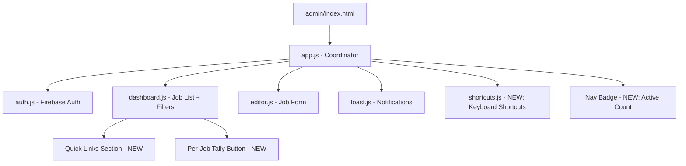

# Design Document: Admin Quality-of-Life Improvements

## Overview

This design covers six quality-of-life improvements to Yasmin's admin panel ("Yasmin's Space"):

1. **Quick Links Section** — A card-based section on the dashboard providing one-click access to Tally, Cal.com, and the live site
2. **Per-Job Tally Form Link** — A "Create Form" button on each job card that opens Tally in a new tab
3. **URL Path Change** — Relocating the admin panel from `/admin/` to `/yasmin/`
4. **Color & Contrast Review** — Ensuring all text and UI components meet WCAG 2.1 AA contrast ratios
5. **Keyboard Shortcut** — Pressing "N" on the dashboard opens the job editor in create mode
6. **Job Count Badge** — A live count of active listings displayed in the nav bar

All changes are additive to the existing vanilla JS module architecture. No build step is introduced. The existing Tailwind CDN + custom config approach is preserved.

## Architecture

The admin panel follows a single-page application pattern with view switching managed by `app.js`. The architecture remains unchanged — we add new UI rendering logic within the existing module boundaries:



**Key architectural decisions:**

- **No new files for Quick Links or Tally button** — these are rendered inline by `dashboard.js` since they are dashboard UI elements
- **New `shortcuts.js` module** — keyboard shortcut logic is isolated for testability and separation of concerns
- **Nav badge logic lives in `app.js`** — it coordinates between dashboard state and the nav bar, which is app.js's responsibility
- **Directory rename** — the `/admin/` folder becomes `/yasmin/`; all relative paths (`../js/`, `../css/`, `../assets/`) remain valid since the directory depth doesn't change

## Components and Interfaces

### 1. Quick Links Section (in `dashboard.js`)

Rendered inside `renderDashboardShell()`, positioned between `#admin-greeting` and the "Your Listings" header.

```javascript
/**
 * Renders the Quick Links section with external tool cards.
 * Each link opens in a new tab with security attributes.
 * @returns {string} HTML string for the quick links section
 */
function renderQuickLinks() { ... }
```

**Links rendered:**
| Label | URL | Icon |
|-------|-----|------|
| Create New Tally Form | https://tally.so/forms/create | Document/form icon |
| Cal.com Settings | https://app.cal.com | Calendar icon |
| View Live Site | `../` (relative root) | External link icon |

Each link is an `<a>` element styled as a card/pill with:
- `target="_blank"` and `rel="noopener noreferrer"`
- Minimum 44×44px touch target
- Hover feedback consistent with butterfly theme (lavender → rose transition)

### 2. Per-Job Tally Button (in `dashboard.js`)

Added to `createJobCardElement()` in the card footer actions row, between the "View" link and the "Edit" button.

```javascript
// Inside createJobCardElement(), in the footer actions div:
<a
  href="https://tally.so/forms/create"
  target="_blank"
  rel="noopener noreferrer"
  class="... text-butterfly-gold bg-butterfly-gold/10 ..."
  aria-label="Create Tally form for ${job.title}"
  onclick="event.stopPropagation()"
>
  Create Form
</a>
```

- Uses `event.stopPropagation()` to prevent triggering the card's click-to-edit handler
- Styled with `butterfly-gold` text on `butterfly-gold/10` background
- Includes a document/form SVG icon + "Create Form" label

### 3. URL Path Change

**Physical change:** Rename directory `admin/` → `yasmin/`

**Affected references:**
- `admin/index.html` → `yasmin/index.html` (file moves, no content change needed for relative paths)
- `admin/js/*.js` → `yasmin/js/*.js` (all imports use relative `../../js/firebase-config.js` which still resolves correctly)
- Any links in the main site pointing to `/admin/` must update to `/yasmin/`
- GitHub Actions or deployment configs referencing the admin path

**No redirect needed** — this is a personal admin panel with a single user; no public URLs to preserve.

### 4. Color & Contrast Fixes

Based on WCAG 2.1 AA analysis of the current palette:

| Element | Current | Issue | Fix |
|---------|---------|-------|-----|
| "New Job" button | `bg-butterfly-lavender` (#C4B5FD) + white text | Contrast ratio ~2.5:1 (fails AA) | Change to `bg-[#7C3AED]` (purple-600) or use dark text on lavender bg |
| Muted text | `text-muted` (#8A8380) on white | Ratio ~3.9:1 (fails 4.5:1 for normal text) | Darken to `#6B6560` (~5.0:1) |
| Status "● Active" | `text-xs text-muted` on card gradient | Borderline | Verify ≥ 3:1 for UI component |
| Nav links | `text-text-main` on `nav-glass` | Depends on scroll position/backdrop | Ensure `#2D2926` on translucent bg meets 4.5:1 |
| Filter input placeholder | Default browser gray | May fail 3:1 | Set explicit `placeholder:text-[#6B6560]` |

**Implementation approach:**
- Update `tailwind-config.js` to adjust the `muted` color token
- Override specific button backgrounds in the HTML/JS where lavender is used for text-on-color
- Add a `butterfly-lavender-dark` color (`#7C3AED`) for buttons that need white text

### 5. Keyboard Shortcuts Module (`yasmin/js/shortcuts.js`)

```javascript
/**
 * Keyboard Shortcuts Module
 * Registers global keyboard shortcuts for the admin panel.
 * Shortcuts are only active when appropriate (dashboard visible, no modal, no text input focused).
 */

/**
 * Determines whether a keyboard shortcut should be suppressed.
 * Returns true if focus is in a text input, textarea, select, contenteditable,
 * or if a modal/editor is currently visible.
 * @param {KeyboardEvent} event
 * @param {Object} viewState - { isEditorOpen, isModalOpen }
 * @returns {boolean}
 */
export function shouldSuppressShortcut(event, viewState) { ... }

/**
 * Initializes keyboard shortcut listeners.
 * @param {Object} config
 * @param {Function} config.onNewJob - Callback to open create editor
 * @param {Function} config.getViewState - Returns current view state
 */
export function initShortcuts(config) { ... }
```

**Shortcut: "N" key (no modifiers)**
- Condition: dashboard visible, no modal open, focus not in text input/textarea/select/contenteditable
- Action: calls `onNewJob()` callback (same as clicking "New Job" button)
- Visual hint: small `<kbd>` element near the "New Job" button, hidden below 768px (`hidden md:inline`)

### 6. Job Count Badge (in `app.js` + `dashboard.js`)

The badge is rendered in the nav bar adjacent to "Yasmin's Space" branding.

```javascript
/**
 * Updates the active job count badge in the nav bar.
 * @param {number} count - Number of active jobs
 */
export function updateNavBadge(count) { ... }
```

- Badge HTML: `<span class="rounded-full text-xs px-2 py-0.5 bg-butterfly-lavender text-text-main font-medium">{count}</span>`
- Updated whenever `allJobs` changes (after fetch, toggle, create, delete)
- Hidden during loading state (badge not rendered until data is available)
- `dashboard.js` exposes a `getActiveJobCount()` function; `app.js` calls `updateNavBadge()` after any state change

## Data Models

No new Firestore collections or document fields are introduced. All changes are UI-only.

**Existing job document structure (unchanged):**
```javascript
{
  id: string,           // Firestore document ID
  title: string,
  slug: string,
  companyName: string,
  location: string,
  category: string,
  employmentType: string,
  isActive: boolean,
  description: string,  // HTML from Quill
  createdAt: Timestamp
}
```

**New runtime state (in-memory only):**
```javascript
// In app.js — tracks whether shortcuts should be active
let viewState = {
  isEditorOpen: boolean,
  isModalOpen: boolean
};
```

## Correctness Properties

*A property is a characteristic or behavior that should hold true across all valid executions of a system — essentially, a formal statement about what the system should do. Properties serve as the bridge between human-readable specifications and machine-verifiable correctness guarantees.*

### Property 1: Keyboard shortcut suppression correctness

*For any* keyboard event and view state combination, `shouldSuppressShortcut` SHALL return `true` if and only if at least one of the following conditions holds: (a) the editor view is open, (b) a modal dialog is open, (c) the event target is an `<input>`, `<textarea>`, `<select>`, or `[contenteditable]` element, or (d) a modifier key (Ctrl, Alt, Meta, Shift) is pressed. Otherwise it SHALL return `false`.

**Validates: Requirements 5.1, 5.2, 5.3**

### Property 2: Active job count accuracy

*For any* array of job objects with arbitrary `isActive` boolean values, `getActiveJobCount(jobs)` SHALL return a number equal to the count of jobs where `isActive` is strictly `true`. This property holds regardless of array length, job field contents, or ordering.

**Validates: Requirements 6.1, 6.3**

### Property 3: Create Form button event isolation

*For any* valid job object, when the job card is rendered and the "Create Form" button receives a click event, the card's `onEdit` callback SHALL NOT be invoked (the click event does not propagate to the card's click handler).

**Validates: Requirements 2.5**

### Property 4: Create Form button presence and position

*For any* valid job object (with a non-empty title), the rendered job card's footer actions row SHALL contain a "Create Form" link element positioned after the "View" link and before the "Edit" button in DOM order.

**Validates: Requirements 2.1**

### Property 5: WCAG contrast ratio computation

*For any* two valid sRGB color values (hex format), `computeContrastRatio(foreground, background)` SHALL return a value equal to `(L1 + 0.05) / (L2 + 0.05)` where L1 is the relative luminance of the lighter color and L2 is the relative luminance of the darker color, as defined by WCAG 2.1. The result SHALL always be ≥ 1.0.

**Validates: Requirements 4.1**

## Error Handling

| Scenario | Handling |
|----------|----------|
| Quick Links section fails to render (DOM missing) | Graceful no-op — dashboard still shows job list without quick links |
| Keyboard shortcut fires during unexpected state | `shouldSuppressShortcut` defaults to suppressing if state is ambiguous |
| Nav badge receives NaN or negative count | Clamp to 0, hide badge if count is 0 |
| Directory rename breaks asset paths | Caught during development via manual smoke test; relative paths are depth-invariant |
| Tally/Cal.com external links are unreachable | Not our concern — links open in new tab; user sees the external site's error |

## Testing Strategy

### Test Framework

- **Vitest** (already configured) with **jsdom** environment
- **fast-check** (already installed) for property-based tests

### Unit Tests (Example-Based)

| Test | Validates |
|------|-----------|
| Quick Links section renders 3 links with correct hrefs | Req 1.2, 1.3, 1.4 |
| All Quick Links have `target="_blank"` and `rel="noopener noreferrer"` | Req 1.6 |
| Quick Links have 44px min touch targets | Req 1.7 |
| Create Form button has correct href and styling | Req 2.2, 2.3, 2.4 |
| Keyboard hint element is present with responsive visibility | Req 5.4 |
| Nav badge has correct styling classes | Req 6.2 |
| Badge is hidden during loading state | Req 6.4 |
| Specific color pairs in the app meet WCAG AA thresholds | Req 4.2–4.7 |

### Property-Based Tests

Each property test runs a minimum of 100 iterations using `fast-check`.

| Property | Test File | Tag |
|----------|-----------|-----|
| Property 1: Shortcut suppression | `admin/__tests__/shortcuts.property.test.js` | Feature: admin-quality-of-life, Property 1: Keyboard shortcut suppression correctness |
| Property 2: Active job count | `admin/__tests__/job-count.property.test.js` | Feature: admin-quality-of-life, Property 2: Active job count accuracy |
| Property 3: Event isolation | `admin/__tests__/create-form-button.property.test.js` | Feature: admin-quality-of-life, Property 3: Create Form button event isolation |
| Property 4: Button position | `admin/__tests__/create-form-button.property.test.js` | Feature: admin-quality-of-life, Property 4: Create Form button presence and position |
| Property 5: Contrast ratio | `admin/__tests__/contrast.property.test.js` | Feature: admin-quality-of-life, Property 5: WCAG contrast ratio computation |

### Integration / Smoke Tests

| Test | Type |
|------|------|
| App loads from `/yasmin/` path | Manual smoke test |
| All relative imports resolve after directory rename | Manual verification |
| Nav links resolve correctly from new path | Manual verification |

### Contrast Verification

The specific color pairs used in the admin panel will be verified with example-based tests using the contrast ratio utility function:
- `#2D2926` (text-main) on `#FFFAF5` (warm background) → must be ≥ 4.5:1
- Updated muted color on `#FFFFFF` → must be ≥ 4.5:1
- `#FFFFFF` on `#7C3AED` (new button bg) → must be ≥ 4.5:1
- Status indicator colors on card gradient → must be ≥ 3:1

