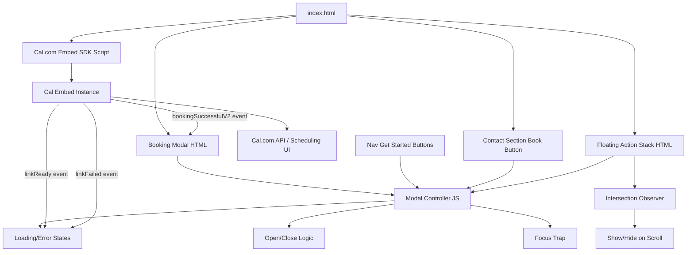
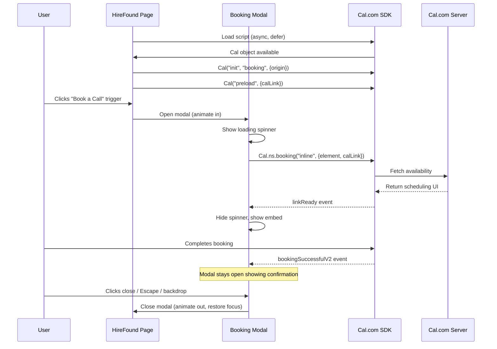
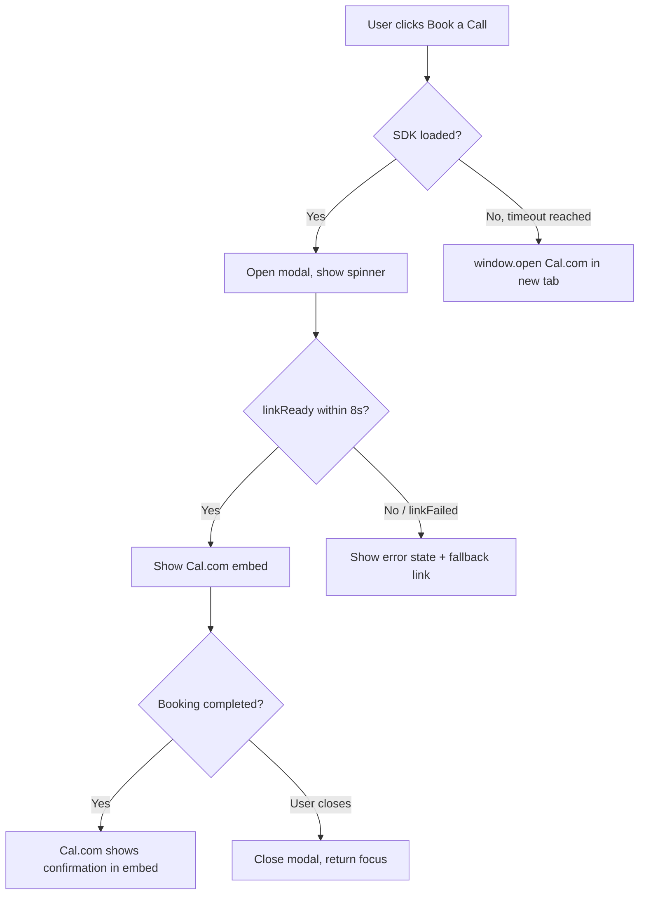

# Design Document: Cal.com Integration

## Overview

This design integrates Cal.com's scheduling functionality into the HireFound single-page website using the Cal.com embed SDK. The integration adds a booking modal, a floating action stack (Book a Call + WhatsApp), a contact section booking button, and rewires the navigation "Get Started" buttons to open the booking modal instead of scrolling to the contact section.

The approach uses Cal.com's popup embed mode triggered programmatically via `Cal("modal", {...})`, wrapped in a custom modal shell that provides branded header, loading states, error fallbacks, and accessibility features. No backend code is required — the embed SDK handles all scheduling logic, timezone detection, and availability data directly from Cal.com's servers.

### Key Design Decisions

1. **Custom modal wrapper over Cal.com's built-in popup**: Cal.com's native popup lacks the branded header (Yasmin's photo + title) and the specific animation/accessibility requirements. We wrap the Cal.com inline embed inside our own modal to control the full UX.

2. **Inline embed inside custom modal**: Rather than using Cal.com's popup mode (which creates its own overlay), we use `Cal("inline", {...})` rendered inside our custom modal container. This gives us full control over backdrop, animations, focus trapping, and close behavior.

3. **Single embed instance**: One Cal.com embed namespace is initialized on page load. The modal shows/hides the container rather than re-initializing the embed each time.

4. **Floating Action Stack replaces existing WhatsApp FAB**: The current single WhatsApp FAB (`#wa-fab`) is replaced by a two-button stack with identical show/hide behavior tied to hero section visibility.

## Architecture



### Integration Flow



## Components and Interfaces

### 1. Cal.com Embed SDK Loader

**Location**: Bottom of `<body>`, before main `<script>` block

```html
<!-- Cal.com Embed SDK (async, non-blocking) -->
<script>
  (function (C, A, L) {
    let p = function (a, ar) { a.q.push(ar); };
    let d = C.document;
    C.Cal = C.Cal || function () {
      let cal = C.Cal;
      let ar = arguments;
      if (!cal.loaded) {
        cal.ns = {}; cal.q = cal.q || [];
        d.head.appendChild(d.createElement("script")).src = A;
        cal.loaded = true;
      }
      if (ar[0] === L) { const api = function () { p(api, arguments); }; const namespace = ar[1]; api.q = api.q || []; if (typeof namespace === "string") { cal.ns[namespace] = cal.ns[namespace] || api; p(cal.ns[namespace], ar); p(cal, ["initNamespace", namespace]); } else p(cal, ar); return; }
      p(cal, ar);
    };
  })(window, "https://app.cal.com/embed/embed.js", "init");

  Cal("init", "booking", { origin: "https://cal.com" });

  Cal.ns.booking("ui", {
    theme: "light",
    cssVarsPerTheme: {
      light: {
        "cal-brand": "#8B2252",
        "cal-brand-emphasis": "#A63B6B",
        "cal-brand-text": "#FFFFFF",
        "cal-bg": "#FFFAF5",
        "cal-bg-emphasis": "#F8F0EA",
        "cal-text": "#2D2926",
        "cal-text-emphasis": "#1A1A2E",
        "cal-text-subtle": "#8A8380",
        "cal-border": "rgba(139, 34, 82, 0.15)",
        "cal-border-booker": "transparent",
        "cal-border-booker-width": "0px"
      }
    }
  });

  Cal.ns.booking("preload", { calLink: "yasminblasi" });
</script>
```

### 2. Booking Modal Component

**HTML Structure**:

```html
<div id="booking-modal" 
     role="dialog" 
     aria-modal="true" 
     aria-labelledby="booking-modal-title"
     class="fixed inset-0 z-[60] hidden"
     data-state="closed">
  
  <!-- Backdrop -->
  <div id="booking-backdrop" 
       class="absolute inset-0 bg-dark/60 transition-opacity duration-300 opacity-0"></div>
  
  <!-- Modal Content -->
  <div id="booking-content"
       class="absolute inset-0 flex items-center justify-center p-4 md:p-6">
    <div id="booking-card"
         class="relative bg-warm rounded-xl md:rounded-2xl w-full max-w-[480px] max-h-[90vh] overflow-hidden shadow-2xl
                transform scale-95 opacity-0 transition-all duration-300
                max-md:!max-w-none max-md:!w-full max-md:!h-full max-md:!max-h-full max-md:!rounded-none">
      
      <!-- Header (max 64px) -->
      <div class="flex items-center gap-3 px-4 py-3 border-b border-primary/10 h-16 flex-shrink-0">
        
        <h2 id="booking-modal-title" class="font-accent text-lg font-bold text-primary flex-1">Book a Call with Yasmin</h2>
        <button id="booking-close-btn" 
                class="w-11 h-11 flex items-center justify-center rounded-full hover:bg-primary/10 transition-colors"
                aria-label="Close booking modal">
          <svg class="w-5 h-5 text-text-main" fill="none" stroke="currentColor" stroke-width="2" viewBox="0 0 24 24">
            <path stroke-linecap="round" stroke-linejoin="round" d="M6 18L18 6M6 6l12 12"/>
          </svg>
        </button>
      </div>
      
      <!-- Body -->
      <div id="booking-body" class="overflow-y-auto flex-1" style="min-height: 400px;">
        <!-- Loading State -->
        <div id="booking-loading" class="flex flex-col items-center justify-center py-16">
          <div class="w-10 h-10 border-3 border-primary/20 border-t-primary rounded-full animate-spin mb-4"></div>
          <p class="text-muted text-sm">Loading calendar...</p>
        </div>
        
        <!-- Cal.com Embed Container -->
        <div id="booking-cal-container" class="hidden w-full"></div>
        
        <!-- Error State -->
        <div id="booking-error" class="hidden flex flex-col items-center justify-center py-16 px-6 text-center">
          <div class="w-12 h-12 rounded-full bg-primary/10 flex items-center justify-center mb-4">
            <svg class="w-6 h-6 text-primary" fill="none" stroke="currentColor" stroke-width="1.5" viewBox="0 0 24 24">
              <path stroke-linecap="round" stroke-linejoin="round" d="M12 9v3.75m9-.75a9 9 0 11-18 0 9 9 0 0118 0zm-9 3.75h.008v.008H12v-.008z"/>
            </svg>
          </div>
          <p class="text-text-main font-semibold mb-2">Calendar unavailable</p>
          <p class="text-muted text-sm mb-6">The scheduling service couldn't be loaded right now.</p>
          <a href="https://cal.com/yasminblasi" target="_blank" rel="noopener"
             class="inline-flex items-center gap-2 px-6 py-2.5 bg-primary text-white text-sm font-semibold rounded-full hover:bg-primary-light transition-colors">
            Book on Cal.com →
          </a>
        </div>
      </div>
    </div>
  </div>
</div>
```

### 3. Floating Action Stack

**HTML Structure** (replaces existing `#wa-fab`):

```html
<div id="action-stack" 
     class="fixed bottom-6 right-6 z-50 flex flex-col gap-3 opacity-0 pointer-events-none transition-opacity duration-500"
     aria-label="Quick actions">
  
  <!-- Book a Call Button -->
  <button id="fab-book" 
          class="inline-flex items-center gap-2 px-5 py-3 bg-primary text-white font-semibold rounded-full shadow-lg hover:bg-primary-light hover:shadow-xl transition-all duration-300 text-sm
                 max-md:px-0 max-md:w-12 max-md:h-12 max-md:justify-center max-md:rounded-full"
          aria-label="Book a Call">
    <svg class="w-5 h-5 flex-shrink-0" fill="none" stroke="currentColor" stroke-width="1.5" viewBox="0 0 24 24">
      <path stroke-linecap="round" stroke-linejoin="round" d="M6.75 3v2.25M17.25 3v2.25M3 18.75V7.5a2.25 2.25 0 012.25-2.25h13.5A2.25 2.25 0 0121 7.5v11.25m-18 0A2.25 2.25 0 005.25 21h13.5A2.25 2.25 0 0021 18.75m-18 0v-7.5A2.25 2.25 0 015.25 9h13.5A2.25 2.25 0 0121 11.25v7.5"/>
    </svg>
    <span class="max-md:hidden">Book a Call</span>
  </button>
  
  <!-- WhatsApp Button -->
  <a id="fab-whatsapp" 
     href="https://wa.me/962793001043?text=Hi%20Yasmin!%20I%20found%20you%20through%20your%20website."
     target="_blank" rel="noopener"
     class="wa-pulse inline-flex items-center gap-2 px-5 py-3 bg-whatsapp text-white font-semibold rounded-full shadow-lg hover:brightness-110 hover:shadow-xl transition-all duration-300 text-sm
            max-md:px-0 max-md:w-12 max-md:h-12 max-md:justify-center max-md:rounded-full"
     aria-label="WhatsApp">
    <svg class="w-5 h-5 flex-shrink-0" fill="currentColor" viewBox="0 0 24 24">
      <path d="M17.472 14.382c-.297-.149-1.758-.867-2.03-.967-.273-.099-.471-.148-.67.15-.197.297-.767.966-.94 1.164-.173.199-.347.223-.644.075-.297-.15-1.255-.463-2.39-1.475-.883-.788-1.48-1.761-1.653-2.059-.173-.297-.018-.458.13-.606.134-.133.298-.347.446-.52.149-.174.198-.298.298-.497.099-.198.05-.371-.025-.52-.075-.149-.669-1.612-.916-2.207-.242-.579-.487-.5-.669-.51-.173-.008-.371-.01-.57-.01-.198 0-.52.074-.792.372-.272.297-1.04 1.016-1.04 2.479 0 1.462 1.065 2.875 1.213 3.074.149.198 2.096 3.2 5.077 4.487.709.306 1.262.489 1.694.625.712.227 1.36.195 1.871.118.571-.085 1.758-.719 2.006-1.413.248-.694.248-1.289.173-1.413-.074-.124-.272-.198-.57-.347m-5.421 7.403h-.004a9.87 9.87 0 01-5.031-1.378l-.361-.214-3.741.982.998-3.648-.235-.374a9.86 9.86 0 01-1.51-5.26c.001-5.45 4.436-9.884 9.888-9.884 2.64 0 5.122 1.03 6.988 2.898a9.825 9.825 0 012.893 6.994c-.003 5.45-4.437 9.884-9.885 9.884m8.413-18.297A11.815 11.815 0 0012.05 0C5.495 0 .16 5.335.157 11.892c0 2.096.547 4.142 1.588 5.945L.057 24l6.305-1.654a11.882 11.882 0 005.683 1.448h.005c6.554 0 11.89-5.335 11.893-11.893a11.821 11.821 0 00-3.48-8.413z"/>
    </svg>
    <span class="max-md:hidden">WhatsApp</span>
  </a>
</div>
```

### 4. Contact Section Book Button

Added alongside the existing "Chat on WhatsApp" button:

```html
<button id="contact-book-btn"
        class="magnetic inline-flex items-center gap-3 px-8 py-4 bg-primary text-white font-bold rounded-full shadow-lg hover:shadow-xl hover:bg-primary-light transition-all duration-300 text-lg">
  <svg class="w-6 h-6" fill="none" stroke="currentColor" stroke-width="1.5" viewBox="0 0 24 24">
    <path stroke-linecap="round" stroke-linejoin="round" d="M6.75 3v2.25M17.25 3v2.25M3 18.75V7.5a2.25 2.25 0 012.25-2.25h13.5A2.25 2.25 0 0121 7.5v11.25m-18 0A2.25 2.25 0 005.25 21h13.5A2.25 2.25 0 0021 18.75m-18 0v-7.5A2.25 2.25 0 015.25 9h13.5A2.25 2.25 0 0121 11.25v7.5"/>
  </svg>
  Book a Call
</button>
```

### 5. Modal Controller (JavaScript Module)

```javascript
const BookingModal = {
  el: null,
  backdrop: null,
  card: null,
  calContainer: null,
  loadingEl: null,
  errorEl: null,
  closeBtn: null,
  triggerEl: null,       // element that opened the modal (for focus return)
  isOpen: false,
  calReady: false,
  loadTimeout: null,
  sdkLoaded: false,

  init() { /* bind elements, attach event listeners */ },
  
  open(triggerElement) {
    // Store trigger for focus return
    // Show modal, animate in
    // Prevent body scroll
    // Initialize Cal embed if not ready
    // Start load timeout (8s)
    // Trap focus
  },

  close() {
    // Animate out
    // Restore body scroll
    // Return focus to triggerEl
    // Clear timeouts
  },

  showError() { /* hide loading, show error state */ },
  showEmbed() { /* hide loading, show cal container */ },
  
  trapFocus(e) { /* Tab/Shift+Tab cycling within modal */ },
  handleKeydown(e) { /* Escape to close */ },
};
```

### Interface: Booking Triggers

All booking triggers call `BookingModal.open(triggerElement)`:
- `#fab-book` (Floating Action Stack)
- `#contact-book-btn` (Contact Section)
- Nav "Get Started" buttons (desktop + mobile)

## Data Models

This integration is purely frontend with no persistent data. The relevant runtime state:

```typescript
interface BookingModalState {
  isOpen: boolean;           // Whether modal is currently visible
  calReady: boolean;         // Whether Cal.com embed has fired linkReady
  sdkLoaded: boolean;        // Whether the Cal.com SDK script loaded successfully
  triggerElement: HTMLElement | null;  // Element that opened the modal (for focus return)
  loadTimeoutId: number | null;       // Timer ID for the 8-second load timeout
}

interface CalEmbedConfig {
  calLink: string;           // "yasminblasi"
  origin: string;            // "https://cal.com"
  namespace: string;         // "booking"
  theme: "light";
  cssVarsPerTheme: {
    light: Record<string, string>;  // Brand color mappings
  };
}
```

No data is stored in localStorage or sent to any backend. Cal.com handles all booking data, confirmation emails, and calendar events on their servers.

## Correctness Properties

*A property is a characteristic or behavior that should hold true across all valid executions of a system — essentially, a formal statement about what the system should do. Properties serve as the bridge between human-readable specifications and machine-verifiable correctness guarantees.*

This feature is a purely frontend UI integration (Cal.com embed SDK in a static HTML page). There are no pure functions with meaningful input/output variation, no data transformations, no parsers or serializers. Property-based testing is not applicable for automated generation of random inputs. However, the following behavioral invariants must hold true across all user interactions:

### Property 1: Modal State Consistency

*For any* booking trigger activation, whenever the modal is in the open state, the modal element must be visible, `document.body` must have scroll disabled, and exactly one of the three content states (loading, embed, error) must be displayed.

**Validates: Requirements 1.4, 4.8**

### Property 2: Scroll Lock/Unlock Pairing

*For any* modal open/close cycle, every open operation that disables body scroll must be paired with a corresponding close operation that restores body scroll. There must be no reachable state where the modal is closed but body scroll remains locked.

**Validates: Requirements 1.5, 4.8**

### Property 3: Focus Return Guarantee

*For any* modal open/close cycle triggered from any booking trigger element, keyboard focus must return to the element that triggered the modal open. If the trigger element is no longer in the DOM, focus must fall back to `document.body`.

**Validates: Requirements 1.5, 4.9**

### Property 4: Focus Trap Containment

*For any* sequence of Tab and Shift+Tab key presses while the modal is open, focus must cycle exclusively among focusable elements within the modal. Focus must never escape to elements behind the backdrop.

**Validates: Requirements 1.4, 4.8**

### Property 5: Floating Action Stack Visibility

*For any* scroll position, the Floating Action Stack must be visible (opacity 1, pointer-events enabled) if and only if no portion of the hero section is within the viewport. When any portion of the hero is visible, the stack must be hidden (opacity 0, pointer-events none).

**Validates: Requirements 2.3, 2.4, 2.9**

### Property 6: Fallback Degradation

*For any* booking trigger activation, if the Cal.com SDK has not loaded and the load timeout has elapsed, the system must redirect to the Cal_URL in a new tab rather than opening an empty or broken modal.

**Validates: Requirements 6.2**

## Error Handling

### SDK Load Failure

| Scenario | Detection | Response |
|----------|-----------|----------|
| Cal.com embed.js fails to load (network error, CDN down) | 10-second timeout after script injection | All booking triggers redirect to `https://cal.com/yasminblasi` in a new tab |
| SDK loads but `linkReady` never fires | 8-second timeout after modal open | Show error state in modal with fallback link |
| SDK fires `linkFailed` event | Cal.com event listener | Show error state in modal with fallback link |

### Modal Error State

When the embed fails to render, the modal displays:
1. An icon indicating the issue
2. Text: "Calendar unavailable" / "The scheduling service couldn't be loaded right now."
3. A fallback CTA linking directly to `https://cal.com/yasminblasi` (opens in new tab)

The error state does not disable or hide the booking trigger buttons — users can retry by closing and reopening the modal.

### Graceful Degradation Strategy



### Focus and Scroll Restoration

- On modal close, `document.body` scroll is restored by removing `overflow: hidden`
- Focus returns to the exact element that triggered the modal open
- If the trigger element is no longer in the DOM (edge case), focus falls back to `document.body`

## Testing Strategy

### Why Property-Based Testing Does Not Apply

This feature is a purely frontend UI integration involving:
- DOM manipulation (showing/hiding elements, adding/removing classes)
- Event handling (click, keydown, scroll via IntersectionObserver)
- Third-party SDK integration (Cal.com embed)
- CSS animations and transitions

There are no pure functions with meaningful input/output variation, no data transformations, no parsers or serializers. PBT is not appropriate for this feature.

### Recommended Testing Approach

**Manual Testing Checklist** (primary validation method for a no-build-tool static site):

1. **SDK Loading**
   - Verify Cal.com embed loads without blocking page render
   - Verify LCP is not degraded (Lighthouse audit)
   - Verify fallback behavior when SDK is blocked (disable script in DevTools)

2. **Modal Behavior**
   - Open from each trigger (FAB, contact button, nav Get Started desktop, nav Get Started mobile)
   - Verify fade-in/scale animation plays
   - Verify Cal.com scheduling UI renders inside modal
   - Verify close via: close button, Escape key, backdrop click
   - Verify fade-out animation plays on close
   - Verify body scroll is locked while open and restored on close
   - Verify focus returns to the trigger element after close

3. **Floating Action Stack**
   - Verify hidden when hero is visible
   - Verify fades in when hero scrolls out of view
   - Verify fades out when scrolling back to hero
   - Verify Book a Call opens modal
   - Verify WhatsApp opens wa.me link in new tab
   - Verify icon-only on mobile (<768px)
   - Verify minimum 44×44px touch targets on mobile

4. **Contact Section**
   - Verify Book a Call button appears alongside WhatsApp button
   - Verify matching visual weight (same padding, font size, rounded-full)
   - Verify clicking opens the booking modal

5. **Navigation Integration**
   - Verify desktop "Get Started" opens modal (not anchor scroll)
   - Verify mobile "Get Started" opens modal (not anchor scroll)

6. **Accessibility**
   - Verify `role="dialog"`, `aria-modal="true"`, `aria-labelledby` present
   - Verify focus trap (Tab cycles within modal)
   - Verify screen reader announces modal title
   - Verify all buttons have accessible names
   - Verify keyboard-only navigation works end-to-end

7. **Mobile Responsiveness**
   - Verify modal is full-screen on <768px
   - Verify close button has 44×44px touch target
   - Verify no horizontal scroll at 320px viewport
   - Verify FAB buttons are icon-only on mobile
   - Verify 16px minimum font size on interactive elements

8. **Post-Booking**
   - Complete a test booking and verify confirmation screen shows within modal
   - Verify modal stays open after booking (no auto-close)
   - Verify close button remains functional after booking

**Integration Test** (if automated testing is added later):
- Playwright/Cypress E2E test that opens the modal, waits for Cal.com embed to load, and verifies the iframe is present and interactive
- Visual regression snapshots for modal open/closed states at 375px and 1440px viewports

