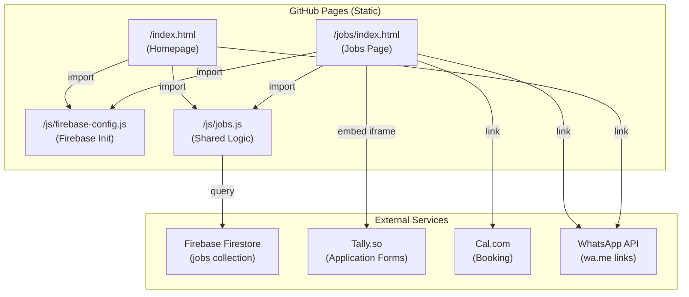
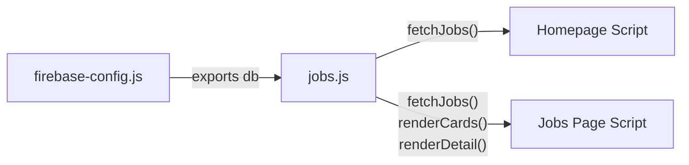
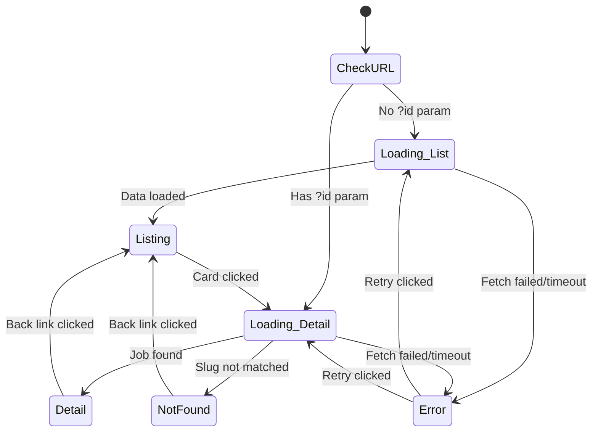

# Technical Design Document

## Overview

This design describes the public-facing jobs feature for HireFound — a static site hosted on GitHub Pages. The feature introduces dynamic job listings powered by Firebase Firestore, replacing hardcoded vacancy cards on the homepage and adding a dedicated jobs page with filtering, detail views, and application flows.

The architecture is entirely client-side: vanilla JavaScript ES modules load the Firebase v9+ modular SDK via CDN, query Firestore directly, and render job data into the DOM. Routing between listing and detail views uses query parameters (`?id=slug`) with `history.pushState` for clean back-button behavior. No build step, no server, no framework.

### Key Design Decisions

1. **Single HTML file for listing + detail**: `/jobs/index.html` handles both views via query parameter routing, avoiding the need for server-side URL rewriting on GitHub Pages.
2. **Shared JS modules**: `firebase-config.js` initializes Firebase once; `jobs.js` contains all fetch/render/filter logic used by both the jobs page and homepage.
3. **Client-side expiry filtering**: Firestore queries fetch `isActive: true` documents, then JavaScript filters out expired jobs (`expiresAt < now`) to avoid requiring a composite index.
4. **Progressive enhancement for RTL**: Arabic content is detected via Unicode range check and wrapped with `dir="rtl" lang="ar"` attributes at the element level, keeping the page LTR by default.

## Architecture



### Module Dependency Flow



### View State Machine (Jobs Page)



## Components and Interfaces

### Module: `/js/firebase-config.js`

Initializes Firebase and exports the Firestore database instance.

```javascript
// firebase-config.js — ES module loaded via CDN imports
import { initializeApp } from 'https://www.gstatic.com/firebasejs/10.x.x/firebase-app.js';
import { getFirestore } from 'https://www.gstatic.com/firebasejs/10.x.x/firebase-firestore.js';

const firebaseConfig = {
  apiKey: "...",
  authDomain: "...",
  projectId: "...",
  storageBucket: "...",
  messagingSenderId: "...",
  appId: "..."
};

let db;
try {
  const app = initializeApp(firebaseConfig);
  db = getFirestore(app);
} catch (error) {
  console.error('Firebase initialization failed:', error);
  db = undefined;
}

export { db };
```

### Module: `/js/jobs.js`

Shared logic for fetching, filtering, and rendering jobs.

**Exported Functions:**

| Function | Signature | Description |
|----------|-----------|-------------|
| `fetchJobs` | `(options?: { limit?: number }) => Promise<Job[]>` | Queries Firestore for active, non-expired jobs |
| `renderJobCards` | `(jobs: Job[], container: HTMLElement) => void` | Renders job card grid into a container |
| `renderJobDetail` | `(job: Job, container: HTMLElement) => void` | Renders full job detail view |
| `renderSkeletons` | `(count: number, container: HTMLElement) => void` | Shows skeleton loading placeholders |
| `renderError` | `(container: HTMLElement, onRetry: Function) => void` | Shows error state with retry button |
| `renderEmpty` | `(container: HTMLElement, message: string) => void` | Shows empty state with contact CTAs |
| `getRelativeTime` | `(timestamp: Timestamp) => string` | Converts Firestore timestamp to "X days ago" |
| `containsArabic` | `(text: string) => boolean` | Detects Arabic Unicode characters |
| `truncateText` | `(text: string, maxLength: number) => string` | Truncates with ellipsis |
| `getCategories` | `(jobs: Job[]) => string[]` | Extracts distinct categories from job list |
| `filterByCategory` | `(jobs: Job[], category: string) => Job[]` | Filters jobs by category (client-side) |

### Page Controller: `/jobs/index.html` (inline script)

Manages view state, URL routing, filter interactions, and history navigation.

**Responsibilities:**
- Parse `?id=` query parameter on load
- Determine view state (LISTING | DETAIL | NOT_FOUND | ERROR)
- Wire up filter pill click handlers
- Handle `popstate` events for back/forward navigation
- Coordinate skeleton → content transitions

### Homepage Integration: `/index.html` (inline script module)

Replaces hardcoded vacancy cards with dynamic Firestore data.

**Responsibilities:**
- Fetch latest 4 active jobs on page load
- Render cards using shared `renderJobCards`
- Handle empty state (no jobs available)
- Show/hide filter pills based on data availability

## Data Models

### Firestore Document Schema: `jobs` collection

```typescript
interface JobDocument {
  // Identity
  id: string;                    // Auto-generated Firestore doc ID
  slug: string;                  // URL-friendly identifier (e.g., "hotel-operations-manager")
  
  // Content
  title: string;                 // English job title (required)
  titleAr: string | null;        // Arabic job title (optional)
  category: string;              // "hospitality" | "tech" | "fnb" | "aviation" | "other"
  location: string;              // e.g., "Amman, Jordan" or "Remote"
  employmentType: string;        // "full-time" | "part-time" | "contract" | "freelance"
  shortDescription: string;      // 1-2 sentence teaser (required)
  shortDescriptionAr: string | null;
  fullDescription: string;       // Full HTML description (required)
  fullDescriptionAr: string | null;
  companyName: string | null;    // Optional client company name
  companyNameAr: string | null;
  salary: string | null;         // Optional salary range text
  
  // Application
  tallyFormId: string | null;    // If set, embed Tally form; if null, show contact CTAs
  contactWhatsApp: string | null; // Override WhatsApp number (falls back to site default)
  contactEmail: string | null;    // Override email (falls back to site default)
  
  // Status
  isActive: boolean;             // Only active jobs shown publicly
  isFeatured: boolean;           // Priority in homepage display
  
  // Timestamps
  createdAt: Timestamp;          // When job was created
  updatedAt: Timestamp;          // When job was last modified
  expiresAt: Timestamp | null;   // Optional auto-expiry date
}
```

### Client-Side Job Object (after fetch)

```typescript
interface Job {
  id: string;
  slug: string;
  title: string;
  titleAr: string | null;
  category: string;
  location: string;
  employmentType: string;
  shortDescription: string;
  shortDescriptionAr: string | null;
  fullDescription: string;
  fullDescriptionAr: string | null;
  companyName: string | null;
  companyNameAr: string | null;
  salary: string | null;
  tallyFormId: string | null;
  contactWhatsApp: string | null;
  contactEmail: string | null;
  isActive: boolean;
  isFeatured: boolean;
  createdAt: Date;               // Converted from Firestore Timestamp
  updatedAt: Date;
  expiresAt: Date | null;
}
```

### View State Enum

```typescript
type ViewState = 'LISTING' | 'DETAIL' | 'NOT_FOUND' | 'ERROR' | 'LOADING';
```

### Site-Wide Defaults

```javascript
const DEFAULTS = {
  whatsApp: '962793001043',
  email: 'yasmin@hirefound.com',
  calLink: 'https://cal.com/yasminblasi',
  queryTimeout: 10000  // 10 seconds
};
```

### Category Color Map

```javascript
const CATEGORY_COLORS = {
  hospitality: { bg: 'bg-primary/10', text: 'text-primary' },
  tech:        { bg: 'bg-blue-50', text: 'text-blue-700' },
  fnb:         { bg: 'bg-amber-50', text: 'text-amber-700' },
  aviation:    { bg: 'bg-indigo-50', text: 'text-indigo-700' },
  other:       { bg: 'bg-gray-100', text: 'text-gray-600' }
};
```

## Correctness Properties

*A property is a characteristic or behavior that should hold true across all valid executions of a system — essentially, a formal statement about what the system should do. Properties serve as the bridge between human-readable specifications and machine-verifiable correctness guarantees.*

### Property 1: Expiry filtering excludes only expired jobs

*For any* list of job objects, filtering by expiry SHALL include all jobs where `expiresAt` is null or is a date in the future, and SHALL exclude all jobs where `expiresAt` is a date in the past. The resulting list length SHALL equal the count of non-expired jobs in the input.

**Validates: Requirements 2.3**

### Property 2: Job card contains all required display fields

*For any* valid job object with non-null required fields, the rendered job card HTML SHALL contain the job title, category badge text, location text, a description substring (up to 120 characters), and employment type text.

**Validates: Requirements 4.2**

### Property 3: Arabic text detection and RTL attribute application

*For any* string, the `containsArabic` function SHALL return true if and only if the string contains at least one character in the Unicode range \u0600-\u06FF. Furthermore, *for any* job with a non-null, non-empty `titleAr` field, the rendered card SHALL contain an element with `dir="rtl"` and `lang="ar"` attributes. *For any* job with a null or empty `titleAr` field, the rendered card SHALL NOT contain an empty RTL element for that field.

**Validates: Requirements 4.3, 6.5, 9.1, 9.2, 9.3**

### Property 4: Category extraction produces correct distinct set

*For any* list of job objects, `getCategories` SHALL return an array containing exactly the distinct `category` values present in the input list, with no duplicates and no values not present in the input.

**Validates: Requirements 5.1**

### Property 5: Category filtering returns only matching jobs

*For any* list of job objects and any category string, `filterByCategory` SHALL return only jobs whose `category` field equals the given category. When the category is "all", it SHALL return the entire input list unchanged.

**Validates: Requirements 5.3, 5.4**

### Property 6: Job detail renders all available metadata

*For any* valid job object, the rendered detail view SHALL contain the job title, category, location, and employment type. Additionally, for each optional field (`titleAr`, `companyName`, `salary`) that is non-null and non-empty, the rendered detail SHALL contain that field's value.

**Validates: Requirements 6.3**

### Property 7: Tally embed URL construction

*For any* job with a non-null `tallyFormId`, the generated embed URL SHALL contain the tallyFormId, the parameters `transparentBackground=1`, `dynamicHeight=1`, `hideTitle=1`, `alignLeft=1`, and a URL-encoded version of the job title.

**Validates: Requirements 7.1**

### Property 8: Contact CTA message construction

*For any* job without a `tallyFormId`, the rendered WhatsApp link SHALL contain a URL-encoded message that includes the job title, and the rendered email link SHALL contain the job title in the subject parameter.

**Validates: Requirements 7.2**

### Property 9: Contact info fallback to defaults

*For any* job, the contact WhatsApp number used in CTAs SHALL equal the job's `contactWhatsApp` field when it is non-null, and SHALL equal the site-wide default WhatsApp number when it is null. The same rule applies to `contactEmail`.

**Validates: Requirements 7.3, 7.4**

### Property 10: Text truncation correctness

*For any* string and maximum length, `truncateText` SHALL return the original string unchanged if its length is at or below the maximum, and SHALL return a string of exactly `maxLength` characters (including the trailing "…") if the original exceeds the maximum. The truncated result SHALL be a prefix of the original string (minus the ellipsis character).

**Validates: Requirements 4.2**

## Error Handling

### Firestore Query Failures

| Scenario | Jobs Page Behavior | Homepage Behavior |
|----------|-------------------|-------------------|
| Network error | Show error message + retry button, replace all content | Hide cards area, show "temporarily unavailable" + WhatsApp/Book a Call CTAs |
| Timeout (10s) | Same as network error | Same as network error |
| Firebase init failure | `db` is undefined → immediate error state | Same |
| Empty results | Show empty state with contact CTAs | Show message + CTAs, hide filter pills, keep section visible |

### Error State Recovery

1. User clicks "Retry" button
2. Error UI is replaced with skeleton loaders
3. Firestore query re-executes
4. On success: render job cards
5. On repeated failure: show error state again (no infinite retry loop)

### Edge Cases

- **Expired job accessed via direct URL**: If `?id=slug` matches a job that exists but is expired or inactive, show "Job Not Found" state (same as non-existent slug)
- **history.pushState unavailable**: Prevent navigation, keep current view (graceful degradation)
- **Clipboard API unavailable**: Show fallback message or silently fail the share action
- **Tally script fails to load**: The embed container remains empty; no crash. Consider showing a fallback "Apply via email" link.
- **Malformed Firestore data**: Missing required fields should be handled defensively — skip rendering that card rather than crashing the entire page

### Console Logging Strategy

- Firebase init errors: `console.error`
- Query failures: `console.error` with query details
- Data validation warnings (missing fields): `console.warn`
- No user-facing technical error messages — always friendly language

## Testing Strategy

### Property-Based Tests (fast-check)

The project will use [fast-check](https://github.com/dubzzz/fast-check) for property-based testing, loaded via CDN or as a dev dependency. Each property test runs a minimum of 100 iterations.

**Library**: fast-check (JavaScript PBT library)
**Runner**: Vitest or plain test runner with ES module support
**Iterations**: Minimum 100 per property

Properties to implement:
1. Expiry filtering — generate random job arrays with various `expiresAt` values
2. Job card rendering — generate random valid job objects, verify output HTML
3. Arabic detection — generate random strings with/without Arabic chars
4. Category extraction — generate random job arrays with various categories
5. Category filtering — generate random jobs + random category selection
6. Detail rendering — generate random jobs with optional fields
7. Tally embed URL — generate random tallyFormId + title combinations
8. Contact CTA construction — generate random jobs without tallyFormId
9. Contact info fallback — generate random jobs with/without contact overrides
10. Text truncation — generate random strings of various lengths

Each test tagged with: **Feature: jobs-feature, Property {N}: {property_text}**

### Unit Tests (Example-Based)

- Firebase initialization success/failure
- Skeleton loader renders correct count
- Empty state renders with correct message and CTAs
- Filter pill active state toggling
- URL routing: listing vs detail vs not-found
- Share button clipboard interaction
- history.pushState navigation
- Relative time formatting ("just now", "2 days ago", "1 month ago")

### Integration Tests

- Firestore query construction (mock Firestore, verify query params)
- Full page render cycle: load → skeleton → cards
- Filter interaction: click pill → cards update
- Detail navigation: click card → detail view → back link → listing

### Manual Testing Checklist

- RTL rendering visual check (Arabic text alignment)
- Responsive layout at 320px, 768px, 1024px, 1440px
- Keyboard navigation (Tab through all interactive elements)
- Screen reader announcement of dynamic content changes
- Tally form embed loads and submits correctly
- WhatsApp/Email links open correct apps with pre-filled content
- Browser back/forward between listing and detail views
- Slow network simulation (skeleton visibility)
- Offline behavior (error state appears)

