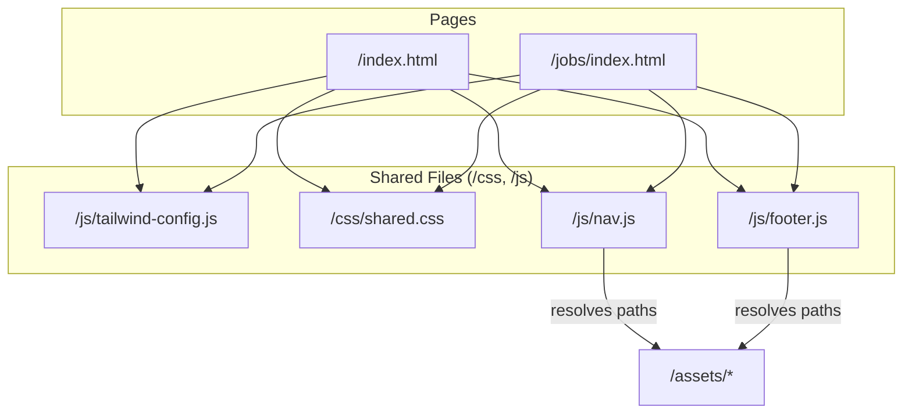

# Design Document: Unified Site Components

## Overview

This design extracts shared UI elements (navigation, footer, Tailwind config, CSS) from the HireFound static site into reusable modules. The homepage (`/index.html`) is the source of truth. The approach uses vanilla JavaScript ES modules and plain CSS/JS files — no build tools, no framework.

The key challenge is maintaining identical visual output while eliminating duplication across pages at different directory depths (`/index.html` vs `/jobs/index.html`). The solution uses a path-resolution utility that computes relative prefixes based on page depth, enabling shared components to reference assets correctly from any location.

## Architecture



**Loading Order (per page `<head>`):**
1. Google Fonts preconnect + stylesheet (DM Serif Display, Inter, Noto Sans Arabic)
2. `/js/tailwind-config.js` (sets `window.tailwind.config`)
3. Tailwind CDN script (`https://cdn.tailwindcss.com`)
4. `/css/shared.css` via `<link>`
5. Page-specific `<style>` block (overrides if needed)

**Component Initialization (end of `<body>`):**
```html
<script type="module">
  import { initNav } from '/js/nav.js';   // or '../js/nav.js'
  import { initFooter } from '/js/footer.js';
  initNav(document.getElementById('navbar'));
  initFooter(document.getElementById('footer'));
</script>
```

## Components and Interfaces

### 1. Shared Tailwind Config (`/js/tailwind-config.js`)

A plain JS file that assigns the Tailwind configuration to `tailwind.config` before the CDN script executes.

```javascript
// /js/tailwind-config.js
tailwind.config = {
  theme: {
    extend: {
      colors: {
        warm: '#FFFAF5',
        'warm-dark': '#F8F0EA',
        primary: '#8B2252',
        'primary-light': '#A63B6B',
        'primary-dark': '#6D1A3F',
        secondary: '#D4A574',
        'secondary-light': '#E0BA92',
        dark: '#1A1A2E',
        'dark-light': '#252540',
        'text-main': '#2D2926',
        muted: '#8A8380',
        success: '#7A9E7E',
        whatsapp: '#25D366',
      },
      fontFamily: {
        sans: ['Inter', 'system-ui', 'sans-serif'],
        accent: ['"DM Serif Display"', 'Georgia', 'serif'],
      },
      boxShadow: {
        card: '0 4px 24px rgba(45, 41, 38, 0.06)',
        'card-hover': '0 12px 40px rgba(45, 41, 38, 0.12)',
        warm: '0 4px 20px rgba(139, 34, 82, 0.12)',
        glow: '0 0 40px rgba(139, 34, 82, 0.2)',
        glass: '0 8px 32px rgba(0, 0, 0, 0.06)',
      },
    }
  }
};
```

**Interface:** No exports. Side-effect only — sets `tailwind.config` on the global scope.

**Loading:** `<script src="/js/tailwind-config.js"></script>` placed *before* the Tailwind CDN `<script>`.

### 2. Shared CSS (`/css/shared.css`)

Contains all CSS rules duplicated between pages. Sourced from the homepage version.

**Contents:**
- CSS custom properties (`:root` block with `--ease-out-quint`, `--ease-out-expo`, `--primary`, `--secondary`, `--dark`)
- `.nav-glass` (backdrop-blur nav styling)
- `.reveal` / `.revealed` (scroll reveal animation)
- `.premium-card` (card hover effects with gradient top border)
- `.filter-pill` (category filter buttons)
- `.skip-link` (accessibility skip navigation)
- Focus indicator rules (`a:focus-visible`, `button:focus-visible`, `[tabindex="0"]:focus-visible`)
- `prefers-reduced-motion` media query
- Arabic font rule (`[lang="ar"], [dir="rtl"]`)

**Interface:** No JS interface. Loaded via `<link rel="stylesheet" href="/css/shared.css">`.

### 3. Nav Component (`/js/nav.js`)

An ES module that renders the navigation bar into a container element.

```typescript
// Public API
export function initNav(container: HTMLElement): void;
```

**Parameters:**
- `container` — the `<nav>` element to render into

**Behavior:**
- Detects current page via `window.location.pathname`
- If on homepage (`/` or `/index.html`): links use anchors (`#about`, `#vacancies`, etc.), nav starts hidden and slides in after scroll past hero
- If on other pages: links use absolute paths (`/#about`, `/jobs/`, `/#services`, `/#how-it-works`), nav is visible immediately
- Resolves asset paths using `getBasePath()` utility
- "Get Started" button: on homepage opens booking modal (`window.BookingModal.open()`), on other pages navigates to `/#contact`
- Highlights active page link with `aria-current="page"`, semibold font, and bottom border

**Menu Items (canonical labels from homepage):**
| Label | Homepage href | Other pages href |
|-------|--------------|-----------------|
| About | `#about` | `/#about` |
| Find Your Match | `#vacancies` | `/jobs/` |
| Services | `#services` | `/#services` |
| Process | `#how-it-works` | `/#how-it-works` |
| Get Started (CTA) | triggers modal | `/#contact` |

### 4. Footer Component (`/js/footer.js`)

An ES module that renders the footer into a container element.

```typescript
// Public API
export function initFooter(container: HTMLElement): void;
```

**Parameters:**
- `container` — the element to render the footer into

**Rendered Structure:**
1. Dark background section (`bg-dark`) with decorative radial gradients
2. Contact CTA: heading, subtext, WhatsApp button, Book a Call button
3. Social links row: LinkedIn, Instagram, Email
4. Logo image (`hirefound-logo-white.svg`)
5. Tagline: "Looking for a Hire? We've got you Found."
6. Italic tagline: "Find your match. Find your future."
7. Credit line: "Made with ❤ by Mohammad Noor"
8. Copyright: "© 2026 HireFound. All rights reserved."

**Path Resolution:**
Uses `getBasePath()` to compute the relative prefix for assets.

### 5. Path Resolution Utility

A shared helper used by both Nav and Footer components.

```javascript
/**
 * Computes the relative path prefix from the current page to the project root.
 * - "/" or "/index.html" → "" (empty string)
 * - "/jobs/index.html" or "/jobs/" → "../"
 * - "/a/b/index.html" → "../../"
 * @returns {string} The relative prefix (e.g., "", "../", "../../")
 */
export function getBasePath() {
  const path = window.location.pathname;
  // Normalize: remove trailing filename, count directory segments
  const segments = path.split('/').filter(Boolean);
  // If last segment has a dot (file), remove it
  if (segments.length > 0 && segments[segments.length - 1].includes('.')) {
    segments.pop();
  }
  if (segments.length === 0) return '';
  return '../'.repeat(segments.length);
}
```

This function lives in `/js/nav.js` or a small shared utility. Since the project avoids bare imports, it can be duplicated in both modules or exported from one and imported by the other using a relative path.

**Decision:** Export from `/js/utils.js` and import in both `nav.js` and `footer.js`:
```javascript
import { getBasePath } from './utils.js';
```

## Data Models

This feature does not introduce persistent data models. The components operate on static configuration:

### NavConfig (implicit)

```javascript
const NAV_ITEMS = [
  { label: 'About',          homepageHref: '#about',      otherHref: '/#about' },
  { label: 'Find Your Match', homepageHref: '#vacancies',  otherHref: '/jobs/' },
  { label: 'Services',       homepageHref: '#services',   otherHref: '/#services' },
  { label: 'Process',        homepageHref: '#how-it-works', otherHref: '/#how-it-works' },
];
```

### FooterConfig (implicit)

```javascript
const FOOTER_CONFIG = {
  whatsAppNumber: '962793001043',
  whatsAppMessage: "Hi Yasmin! I found you through your website.",
  calLink: 'https://cal.com/yasminblasi',
  linkedIn: 'https://www.linkedin.com/in/yasminblasi',
  instagram: 'https://www.instagram.com/hirefound',
  email: 'yasmin@hirefound.com',
  logoFile: 'hirefound-logo-white.svg',
  tagline: "Looking for a Hire? We've got you Found.",
  italicTagline: "Find your match. Find your future.",
  credit: { text: 'Mohammad Noor', url: 'https://noor.sh' },
  copyright: '© 2026 HireFound. All rights reserved.',
};
```


## Correctness Properties

*A property is a characteristic or behavior that should hold true across all valid executions of a system — essentially, a formal statement about what the system should do. Properties serve as the bridge between human-readable specifications and machine-verifiable correctness guarantees.*

Most of this feature involves DOM rendering, CSS extraction, and configuration — areas where property-based testing adds limited value. However, the `getBasePath()` path resolution utility is a pure function with a large input space (arbitrary URL paths) and a clear invariant, making it an excellent candidate for PBT.

### Property 1: Path resolution depth invariant

*For any* valid URL pathname consisting of zero or more directory segments (optionally ending with a filename containing a dot), `getBasePath()` SHALL return a string consisting of `"../"` repeated exactly N times, where N is the number of directory segments (excluding the filename segment if present). For root paths (N=0), the result SHALL be an empty string.

**Validates: Requirements 4.4, 7.1, 7.2, 7.4**

### Property 2: Path resolution round-trip with asset concatenation

*For any* valid URL pathname and any asset filename, concatenating `getBasePath(pathname)` with `"assets/" + filename` SHALL produce a relative URL that, when resolved from the page's directory, points to the same absolute path `/assets/{filename}`.

**Validates: Requirements 7.1, 7.2, 7.4**

## Error Handling

| Scenario | Behavior | Fallback |
|----------|----------|----------|
| Shared Tailwind config fails to load | Tailwind CDN uses its default config | Page renders with default Tailwind colors/fonts; content remains visible and interactive |
| Shared CSS file fails to load | Browser applies only inline page-specific styles + Tailwind utilities | Layout may differ visually but all content remains visible, no overlapping elements |
| Nav JS module fails to load | Container element remains empty | Page should include a `<noscript>` fallback or static nav markup as progressive enhancement |
| Footer JS module fails to load | Container element remains empty | Page should include a `<noscript>` fallback with basic contact info |
| `getBasePath()` returns wrong prefix | Asset URLs 404 | Components should use `onerror` handlers on images to hide broken indicators gracefully |
| `window.BookingModal` not defined (on homepage) | "Get Started" click handler catches error | Falls back to navigating to `/#contact` |

**Progressive Enhancement Strategy:**

Each page includes minimal static markup in the nav/footer containers as a baseline. The JS modules enhance this markup. If JS fails, the static content remains functional:

```html
<nav id="navbar" class="fixed top-0 left-0 right-0 z-50 nav-glass">
  <!-- Static fallback: simple link to homepage -->
  <noscript>
    <div class="max-w-6xl mx-auto px-6 py-3">
      <a href="/" class="font-accent text-xl font-bold text-primary">HireFound</a>
    </div>
  </noscript>
</nav>
```

## Testing Strategy

### Unit Tests (Example-Based)

Since this feature is primarily about DOM rendering and CSS extraction, the bulk of testing uses example-based unit tests:

**Nav Component Tests:**
- Renders correct labels in correct order
- Homepage: links use anchor hrefs (`#about`, `#vacancies`, etc.)
- Non-homepage: links use absolute paths (`/#about`, `/jobs/`, etc.)
- Jobs page: "Find Your Match" link has `aria-current="page"` and active styling
- Mobile CTA has min-height/min-width of 44px
- Homepage: "Get Started" calls `BookingModal.open()`
- Non-homepage: "Get Started" links to `/#contact`
- Homepage: nav starts hidden (translate-y off-screen)
- Non-homepage: nav is immediately visible

**Footer Component Tests:**
- Renders all required elements (CTA, social links, logo, taglines, credit, copyright)
- Content matches homepage source of truth
- Asset paths use correct prefix for page depth

**Shared Config Tests:**
- Tailwind config contains all required color tokens
- Tailwind config contains required font families
- Shared CSS contains all required class definitions

### Property-Based Tests

**Library:** [fast-check](https://github.com/dubzzz/fast-check) (JavaScript PBT library)

**Configuration:** Minimum 100 iterations per property test.

**Property 1: Path resolution depth invariant**
- Tag: `Feature: unified-site-components, Property 1: For any valid URL pathname, getBasePath() returns "../" repeated N times where N is the directory depth`
- Generator: Random URL paths with 0-5 directory segments, optionally ending with a filename
- Assertion: Result length equals `segments * 3` (each `../` is 3 chars), and result matches `/^(\.\.\/)*$/`

**Property 2: Path resolution round-trip with asset concatenation**
- Tag: `Feature: unified-site-components, Property 2: For any valid URL pathname and asset filename, getBasePath() + "assets/" + filename resolves to /assets/{filename}`
- Generator: Random URL paths + random asset filenames
- Assertion: Simulated URL resolution from page directory produces the correct absolute path

### Integration Tests

- Load each page with a static server and verify no 404 errors for assets
- Verify computed styles on nav and cards match expected values
- Visual regression comparison before/after refactor (manual)

### Static Analysis Checks

- Verify no inline `tailwind.config` in HTML files after refactor
- Verify no duplicated CSS class definitions between shared file and inline styles
- Verify all JS files use only standard ES module syntax (no TypeScript, no JSX)
- Verify `<link>` for shared CSS precedes `<style>` block in each page's `<head>`
