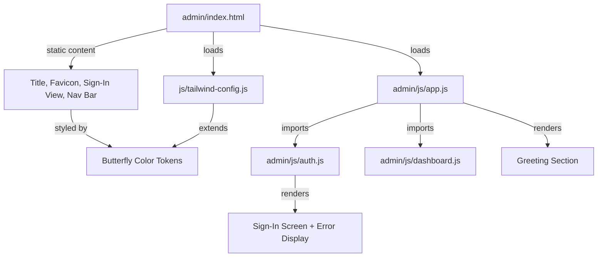

# Design Document: Yasmin Admin Experience

## Overview

This feature transforms the HireFound admin panel from a generic admin tool into a personalized, butterfly-themed workspace for Yasmin. The changes are purely presentational and UX-focused — no backend changes, no new routes, no new dependencies. All modifications happen within the existing static HTML/JS architecture served via Firebase Hosting.

The design touches six areas:
1. Page identity (title, nav branding, sign-in text)
2. Personalized greeting with affectionate templates
3. Butterfly visual theme (SVGs, animation, favicon)
4. Extended Tailwind color palette
5. Authenticated user indicator in nav
6. Sign-in screen personality

All changes preserve existing functionality (job CRUD, auth flow, dashboard filters) while layering on the new aesthetic.

## Architecture

The feature requires no architectural changes. The existing module structure remains:

```
/admin/index.html          ← HTML shell (title, favicon, sign-in view, nav)
/admin/js/app.js           ← Greeting logic, view coordination
/admin/js/auth.js          ← Auth flow, sign-in/sign-out, error display
/admin/js/dashboard.js     ← Job cards, filters
/js/tailwind-config.js     ← Shared Tailwind theme extension
/css/shared.css            ← Shared CSS (nav-glass, animations)
```

Changes are distributed across these existing files with no new modules needed. A new butterfly favicon SVG asset will be added to `/assets/`.



## Components and Interfaces

### 1. Tailwind Config Extension (`/js/tailwind-config.js`)

Add butterfly-theme color tokens to the existing `theme.extend.colors` object:

```javascript
// Added alongside existing colors (primary, secondary, warm, etc.)
'butterfly-lavender': '#C4B5FD', // purple-300
'butterfly-rose': '#FDA4AF',     // rose-300
'butterfly-gold': '#FCD34D',     // amber-300
```

These tokens become available as Tailwind utilities (`bg-butterfly-lavender`, `text-butterfly-rose`, `border-butterfly-gold`, etc.).

### 2. Page Identity Changes (`/admin/index.html`)

| Element | Before | After |
|---------|--------|-------|
| `<title>` | HireFound Admin | Yasmin's Space |
| Nav branding `<a>` | HireFound Admin | Yasmin's Space |
| Sign-in `<h1>` | Admin Panel | Yasmin's Space |
| Sign-in `<p>` | Sign in to manage job posts | Welcome back, beautiful ✨ |
| Favicon `<link>` | hirefound-signature.svg | butterfly-favicon.svg |

### 3. Greeting Module (`/admin/js/app.js` — `renderGreeting`)

**Greeting Templates** (pool of ≥3):
```javascript
const GREETING_TEMPLATES = [
  (name) => `Hey ${name} ✨`,
  (name) => `Welcome back, ${name} 🦋`,
  (name) => `Hi ${name}, lovely to see you 💜`,
  (name) => `Hello ${name} 🌸`,
];
```

**Subtitle Pool** (pool of ≥4, each ≤60 chars):
```javascript
const SUBTITLES = [
  'Your next great hire is one click away.',
  'Ready to find someone amazing?',
  "Let's connect talent with opportunity.",
  'Time to make magic happen ✨',
  'The perfect candidate is out there 🦋',
];
```

**Name Extraction Logic:**
```javascript
function extractFirstName(displayName) {
  if (!displayName || !displayName.trim()) return 'Yasmin';
  return displayName.trim().split(' ')[0];
}
```

**Fallback Avatar:** When `user.photoURL` is null/empty, render an inline butterfly SVG (48×48px) instead of the current initial-circle `<div>`.

### 4. Butterfly Animation (`/admin/js/app.js` or inline CSS)

A CSS keyframe animation that plays once on successful authentication:

```css
@keyframes butterflyEntrance {
  0% { opacity: 0; transform: scale(0.8) translateY(10px); }
  50% { opacity: 1; transform: scale(1.05) translateY(-5px); }
  100% { opacity: 0; transform: scale(1) translateY(0); }
}

.butterfly-entrance {
  animation: butterflyEntrance 1.5s ease-out forwards;
}

@media (prefers-reduced-motion: reduce) {
  .butterfly-entrance {
    animation: none;
    opacity: 0;
    display: none;
  }
}

@media (max-width: 767px) {
  .butterfly-entrance svg {
    width: 32px;
    height: 32px;
  }
}
```

The animation element is injected into the DOM on auth success, plays once (1.5s), then is removed from the DOM.

### 5. Nav Bar User Indicator (`/admin/js/app.js` — `handleAuthenticated`)

**Truncation Logic:**
```javascript
function truncateUserIdentifier(user) {
  const identifier = user.displayName || user.email || '';
  if (identifier.length <= 30) return identifier;
  return identifier.substring(0, 30) + '…';
}
```

Rendered as a `<span class="text-muted text-xs">` positioned before the Sign Out button in the nav's right-aligned flex group.

### 6. Sign-In Error Display (`/admin/js/auth.js` — `showSignInError`)

Update the error element to use butterfly-theme colors and add ARIA role:

```javascript
errorEl.className = 'sign-in-error text-butterfly-rose text-sm mt-4';
errorEl.setAttribute('role', 'alert');
```

### 7. Auth Restore (`/admin/js/auth.js` — `restoreSignInScreen`)

Update the `restoreSignInScreen` function to render the new Yasmin-branded content (butterfly icon, "Yasmin's Space" heading, "Welcome back, beautiful ✨" subtext) instead of the old HireFound branding.

## Data Models

No new data models are introduced. The feature operates entirely on the existing Firebase Auth `user` object:

```typescript
interface UserContext {
  displayName: string | null;  // From Google account
  email: string;               // Always present for Google auth
  photoURL: string | null;     // Google profile photo
}
```

**Greeting Configuration (constants, not persisted):**

```typescript
interface GreetingConfig {
  templates: Array<(name: string) => string>;  // ≥3 templates
  subtitles: string[];                          // ≥4 phrases, each ≤60 chars
  fallbackName: string;                         // "Yasmin"
}
```

**Color Tokens (in Tailwind config, not persisted):**

```typescript
interface ButterflyColors {
  'butterfly-lavender': string;  // #C4B5FD
  'butterfly-rose': string;      // #FDA4AF
  'butterfly-gold': string;      // #FCD34D
}
```

## Correctness Properties

*A property is a characteristic or behavior that should hold true across all valid executions of a system — essentially, a formal statement about what the system should do. Properties serve as the bridge between human-readable specifications and machine-verifiable correctness guarantees.*

### Property 1: Greeting always contains a valid first name from template pool

*For any* user object with any display name (including null, undefined, empty string, or whitespace-only), the greeting function SHALL produce a string that contains either the first space-delimited segment of the display name or the fallback "Yasmin", and the greeting SHALL match exactly one of the predefined template patterns.

**Validates: Requirements 2.1, 2.3**

### Property 2: Subtitles are always from the predefined pool and within length limit

*For any* invocation of the subtitle selector, the returned subtitle SHALL be a member of the predefined subtitle pool, and its length SHALL not exceed 60 characters.

**Validates: Requirements 2.2**

### Property 3: Photo URL presence determines avatar rendering

*For any* user object with a non-empty photoURL string, the greeting renderer SHALL produce HTML containing an `` element with that URL and 48×48 pixel dimensions. *For any* user object with a null or empty photoURL, the renderer SHALL produce HTML containing a butterfly SVG element of 48×48 pixel dimensions and SHALL NOT contain an initial-circle fallback.

**Validates: Requirements 2.4, 2.5**

### Property 4: Original Tailwind color tokens are preserved alongside butterfly tokens

*For any* color token in the original set (primary, primary-light, primary-dark, secondary, secondary-light, warm, warm-dark, dark, dark-light, text-main, muted, success, whatsapp), the extended Tailwind configuration SHALL still contain that token with its original value, AND SHALL additionally contain butterfly-lavender, butterfly-rose, and butterfly-gold.

**Validates: Requirements 4.5, 4.1**

### Property 5: User identifier truncation respects 30-character limit with correct fallback

*For any* user object, the nav bar identifier function SHALL return the display name if available (falling back to email), truncated to at most 30 visible characters plus an ellipsis character when the source exceeds 30 characters, and SHALL return the full string unmodified when it is 30 characters or fewer.

**Validates: Requirements 5.1**

### Property 6: Sign-in error messages have correct ARIA role and butterfly styling

*For any* non-empty error message string, the error display function SHALL produce an element with `role="alert"` attribute and a class list containing butterfly-theme color references.

**Validates: Requirements 6.4**

## Error Handling

| Scenario | Current Behavior | New Behavior |
|----------|-----------------|--------------|
| Sign-in popup blocked | Red error text below button | Same text, styled with `text-butterfly-rose`, `role="alert"` added |
| Sign-in popup closed | No error shown | No change |
| Access denied (wrong email) | Shows "Access Denied" heading, auto sign-out | No change to flow; after auto sign-out, restored screen shows Yasmin branding |
| Firebase Auth unavailable | Shows error with retry button | No change to flow; styling updated to butterfly theme |
| `user.displayName` is null | Falls back to first initial in circle | Falls back to "Yasmin" name + butterfly SVG avatar |
| `user.photoURL` is null | Shows initial circle | Shows butterfly SVG fallback avatar |
| Greeting template pool empty | N/A (hardcoded pool) | Pool is a constant with ≥3 entries; no runtime failure path |

No new error states are introduced. The feature only modifies presentation of existing error flows.

## Testing Strategy

### Property-Based Tests (Vitest + fast-check)

The project already uses Vitest with fast-check for property-based testing. Each correctness property maps to a property-based test with minimum 100 iterations:

| Property | Test File | What's Generated |
|----------|-----------|-----------------|
| 1: Greeting name extraction | `admin/__tests__/greeting.property.test.js` | Random display names (including null, empty, unicode, multi-word) |
| 2: Subtitle pool invariants | `admin/__tests__/greeting.property.test.js` | Random indices / repeated calls |
| 3: Avatar rendering | `admin/__tests__/greeting.property.test.js` | Random photo URLs and null/empty values |
| 4: Config preservation | `admin/__tests__/tailwind-config.property.test.js` | Enumeration of all original tokens |
| 5: User identifier truncation | `admin/__tests__/nav-indicator.property.test.js` | Random strings of varying lengths (0–200 chars) |
| 6: Error ARIA + styling | `admin/__tests__/auth-error.property.test.js` | Random error message strings |

**Configuration:**
- Library: `fast-check` (already in devDependencies)
- Runner: `vitest` (already configured)
- Minimum iterations: 100 per property
- Tag format: `Feature: yasmin-admin-experience, Property {N}: {title}`

### Unit Tests (Example-Based)

For acceptance criteria classified as EXAMPLE or SMOKE:

| Test | What's Verified |
|------|----------------|
| Page title is "Yasmin's Space" | `document.title` assertion |
| Nav branding text | DOM text content check |
| Sign-in heading and subtext | DOM text content check |
| Restore after access-denied | Flow simulation + DOM check |
| Butterfly SVG in sign-in view | DOM element presence |
| Animation plays on auth (non-reduced-motion) | Class/element injection check |
| Reduced motion disables animation | Media query mock + assertion |
| Favicon references butterfly SVG | Link element href check |
| Gradient background on body | Computed style check |
| Nav links preserved | Anchor href assertions |
| Sign-in button styling | Class list assertions |

### Manual Testing

- Visual verification of butterfly aesthetics across viewports
- Animation timing and smoothness review
- Color contrast verification for accessibility (butterfly colors on white/warm backgrounds)
- Screen reader testing for ARIA roles on error messages
