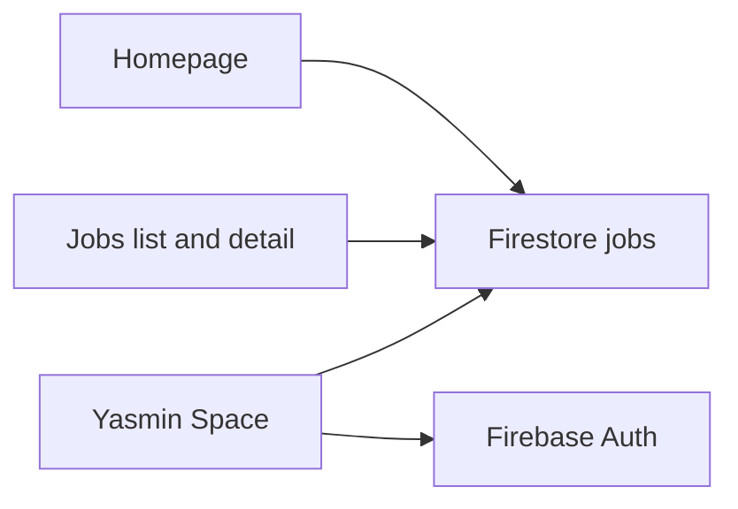

# HireFound platform plan

This file is the source of truth for the move from the vanilla site to Next.js. Update it in the same change that does the work. A pull request that moves the platform without updating this file is incomplete.

**Cutover + Phase 7 execution brief (canonical):** [`rebuild/ultimate-final.md`](../rebuild/ultimate-final.md). This plan keeps living checkboxes, status, and the decision log. Prior rebuild debate docs live in [`rebuild/archive/`](../rebuild/archive/) as history only.

Historical specs in [`.kiro/specs/`](../.kiro/specs/) describe the vanilla site. They stay as history. Do not rewrite them. If a decision here disagrees with a `.kiro` spec, this file wins. If Phase 6/7 *execution order* disagrees with a prior rebuild opinion, [`ultimate-final.md`](../rebuild/ultimate-final.md) wins for how to cut over and redesign.

## Status

| | |
|---|---|
| Current phase | Phase 6 — Cutover (in progress) |
| Next work | Close Phase 6 dual reviews (high-risk gh-pages-export, high-risk firestore-rules `agy`, phase-6-gate), then Stage B delete vanilla. Custom-domain DNS deferred |
| Last updated | 2026-10-09 |
| Live site | GitHub Actions Pages at `https://mohnoor94.github.io/hire-found/` (`basePath` `/hire-found`). Smoke passed 2026-10-09. `hirefound.com` DNS deferred |
| Reviews | Dual Cursor + `agy` at each phase gate, on high-risk items, and on every Phase 7 surface |
| Rebuild strategy | [`rebuild/ultimate-final.md`](../rebuild/ultimate-final.md) (canonical). Debate trail: [`rebuild/archive/`](../rebuild/archive/) |

Status values used below: `not started`, `in progress`, `done`, `deferred`.

## How to update this file

- Change an item's status when work on it starts or finishes.
- Set **Current phase** and **Last updated** at the top in that same change.
- After the 2026-10-09 cutover merge, commit and push on `main` (the branch that deploys).
- Add a dated line to the decision log when a choice changes. Do not open a second plan.
- Leave Phase 7's visual direction blank until Phase 6 cutover/smoke is done; then record one direction line at Stage C per [`rebuild/ultimate-final.md`](../rebuild/ultimate-final.md).
- Do not mark a **phase gate** or **high-risk item** `done` until Cursor and `agy` reviews are both checked. Ordinary checklist items do not each need dual review.

## Decision log

- **2026-10-06** — UI framework is Next.js (App Router) with React, Tailwind, and shadcn/ui.
- **2026-10-06** — Backend stays Firebase Auth and Cloud Firestore, client SDK only. No new backend and no hosted CMS.
- **2026-10-06** — Hosting stays GitHub Pages at `hirefound.com`. Next.js uses `output: 'export'`. At cutover, the workflow uploads the static `out/` folder.
- **2026-10-06** — Job list and job detail stay client-loaded from Firestore. Detail keeps the current `?id=` pattern so a new job works without a rebuild.
- **2026-10-06** — Yasmin's job form is rebuilt with shadcn. `fullDescription` and `fullDescriptionAr` move from Quill 2 to Tiptap and keep saving HTML.
- **2026-10-06** — Migration matches current behavior first. Visual redesign is Phase 7, after parity.
- **2026-10-06** — Implementation happens on branch `v2`, with each change committed and pushed there. `main` keeps serving the vanilla site until Phase 6.
- **2026-10-06** — Phase 7 UI/UX work is dual-reviewed: Cursor first, then Antigravity CLI (`agy`), using [`docs/ui-ux-review-prompt.md`](ui-ux-review-prompt.md). A surface is not `done` until both reviews are recorded.
- **2026-10-06** — Dual review also applies to every phase gate (Phases 1–6) and to named high-risk items, using [`docs/phase-review-prompt.md`](phase-review-prompt.md). Not every checkbox gets dual review.
- **2026-10-06** — Phase 1 `agy` asked for a `v2` lint/test/build CI workflow. Deferred as nice-to-have (not on the Phase 1 checklist). Draft lives at [`.github/workflows/ci.yml`](../.github/workflows/ci.yml); wire or extend it when PR checks are wanted.
- **2026-10-07** — Dropped Yasmin "Already signed in? Tap to refresh" hint; `auth.authStateReady()` + loading state replace it.
- **2026-10-07** — Yasmin primary CTAs use solid violet `#7C3AED` (vanilla light lavender + white failed contrast). Token `--color-butterfly-lavender-dark` kept for parity with `js/tailwind-config.js`.
- **2026-10-07** — Tiptap prep converts Quill 2 `li[data-list=bullet|ordered]` into standard `ul`/`ol` before parse; saves strip trailing empty `<p>`, unwrap `li>p`, and drop link presentation classes so existing Quill jobs are not rewritten as ordered lists.
- **2026-10-07** — Phase 6: Firestore rules `isAdmin()` matches UI `ALLOWED_EMAILS` (both admin emails). Deploy rules with `npm run firebase:deploy-rules`. GH Pages workflow builds Next and uploads `out/` only (vanilla root is no longer the artifact).
- **2026-10-07** — Cutover hosting check: repo Pages is still `build_type: legacy` from `main` `/` (`mohnoor94.github.io/hire-found/`). Apex/`www` `hirefound.com` currently resolves to Squarespace parking, not Pages. Before treating merge as domain cutover: set Pages source to GitHub Actions and point DNS/custom domain at Pages.
- **2026-10-07** — Phase 6 `agy` reviews deferred for the day (high-risk firestore-rules, high-risk gh-pages-export, phase-6-gate). Cursor reviews stay recorded; resume `agy` before marking those items `done`.
- **2026-10-09** — Canonical rebuild strategy: `rebuild/ultimate-final.md`. Phase 6 cutover = preflight on v2 → merge v2→main → green Actions → Pages source to Actions → DNS parallel → smoke; then delete vanilla root (+ root assets only; never public/assets); re-baseline Vitest. Phase 7 = aggressive presentation rebuild (tokens & chrome → homepage → jobs → Yasmin) keeping domain/auth/Firestore/`?id=`/static export. Phase 6 `agy` remains deferred until actually run — do not invent PASS. Defer `/jobs/[slug]` + OG/JSON-LD to Stage E. Prior opinions/revs archived under `rebuild/archive/`.
- **2026-10-09** — Preflight on `v2`: `npm test` 189/189 pass; `npm run build` green (recorded before Stage A merge).
- **2026-10-09** — Fast-forward merged `v2` into `main` at `223bae1`. Actions run [37969404737](https://github.com/mohnoor94/hire-found/actions/runs/37969404737) succeeded: `out/index.html`, `out/jobs/index.html`, `out/yasmin/index.html`, `out/CNAME` = `hirefound.com`, and `deploy-pages` published that artifact.
- **2026-10-09** — Pages source switched to GitHub Actions (`build_type: workflow`). Custom domain DNS deferred: keep serving at `mohnoor94.github.io/hire-found/` for smoke. Interim `basePath` / `assetPrefix` `/hire-found` (plus `withBasePath` for public assets and raw anchors). When attaching `hirefound.com`, set `NEXT_PUBLIC_BASE_PATH=""` / clear `basePath` and configure the custom domain in Pages settings. `public/CNAME` stays `hirefound.com` for that later step. Vitest after basePath helper: 192.
- **2026-10-09** — Stage A smoke on project Pages URL: homepage vacancies, `/jobs/?id=` + apply path, Yasmin sign-in/create/edit → public HTML — all passed (user-confirmed). Phase 6 dual reviews still required before Stage B.



## Locked decisions

- **Framework.** Next.js App Router, React, Tailwind, shadcn/ui.
- **Backend.** Firebase project `hire-found`. Auth and Firestore only, initialized in the browser the way [`js/firebase-config.js`](../js/firebase-config.js) does today. Firebase Hosting, Cloud Functions, and Storage are out of scope.
- **Hosting.** GitHub Pages static export: `output: 'export'`, `trailingSlash: true`, `images.unoptimized: true`. Interim live URL is the project site with `basePath` `/hire-found`. Custom domain `hirefound.com` (and empty `basePath`) is deferred until DNS is pointed at Pages. No Next.js server, API routes, or middleware.
- **Job URLs.** Public detail stays client-loaded (`/jobs/?id={slug}`), matching [`js/jobs.js`](../js/jobs.js). A path like `/jobs/some-new-role` is not a real file for jobs created after the last build, so it is not the live detail URL.
- **Editor.** shadcn form. Tiptap for the two long descriptions, `dir="rtl"` on the Arabic field. Short description stays plain text. Stored HTML in existing jobs must still render.
- **Where the work lives.** Cutover merged `v2` into `main` on 2026-10-09. Later changes commit and push on `main`.
- **Deploy after cutover.** [`.github/workflows/deploy.yml`](../.github/workflows/deploy.yml) builds the Next app and uploads `out/`. Vanilla HTML in the repo root is no longer the Pages artifact.
## Data contract

Collection: `jobs`. Do not rename fields during the migration.

| Field | Role |
|---|---|
| `title` | Required. English title. Max 120. |
| `titleAr` | Optional Arabic title. Max 120. |
| `slug` | Required. `[a-z0-9]+(-[a-z0-9]+)*`, max 80. Generated from `title`, then deduped. |
| `category` | Required. Max 50. Known values include hospitality, tech, fnb, aviation, retail, healthcare, education, finance, marketing, engineering, design, customer-service, logistics, real-estate, media. |
| `location` | Required. Max 100. Suggestions: Jordan, UAE, Saudi Arabia, Qatar, Kuwait, Bahrain, Oman, Egypt, Remote. |
| `employmentType` | Required. One of `full-time`, `part-time`, `contract`, `freelance`. |
| `shortDescription` | Optional plain text. Max 300. |
| `fullDescription` | Optional HTML from the rich-text editor. |
| `fullDescriptionAr` | Optional HTML. Rendered RTL when present. |
| `companyName` | Optional. Max 120. |
| `salary` | Optional display string. Max 100. |
| `contactWhatsApp` | Optional digits, 7–15. Default `962793001043`. |
| `contactEmail` | Optional email. Default `yasmin@hirefound.com`. |
| `tallyFormId` | Optional. When set, apply embeds that Tally form. |
| `createdAt` | Firestore server timestamp. Public list orders by this, descending. |
| `updatedAt` | Firestore server timestamp on edit. |
| `expiresAt` | Optional. Public fetch drops jobs whose `expiresAt` is in the past. |
| `isActive` | Public reads require `true`. Yasmin can read and toggle inactive jobs. |

Public query, from [`js/jobs.js`](../js/jobs.js): `isActive == true`, `orderBy createdAt desc`, optional limit (homepage uses 4), 10-second timeout, then drop expired jobs in the client.

Apply order on the public job: Tally iframe when `tallyFormId` is set, otherwise WhatsApp, email, and Book a Call. Booking link: `https://cal.com/yasminblasi`.

## Known fix

- [x] **Firestore allowlist drift** — `done` (rules file + deployed to `hire-found`). [`firestore.rules`](../firestore.rules) `isAdmin()` matches [`src/lib/yasmin/auth.ts`](../src/lib/yasmin/auth.ts) `ALLOWED_EMAILS`. Re-deploy with `npm run firebase:deploy-rules` if the allowlist changes.

## Historical specs

These folders are the record of the current vanilla site. Leave them in place.

| Spec | What it recorded |
|---|---|
| [`.kiro/specs/jobs-feature/`](../.kiro/specs/jobs-feature/) | Live Firestore jobs on GitHub Pages |
| [`.kiro/specs/admin-job-panel/`](../.kiro/specs/admin-job-panel/) | Google-gated job CRUD |
| [`.kiro/specs/yasmin-admin-experience/`](../.kiro/specs/yasmin-admin-experience/) | Yasmin branding and the butterfly admin |
| [`.kiro/specs/admin-quality-of-life/`](../.kiro/specs/admin-quality-of-life/) | `/yasmin/`, quick links, shortcuts |
| [`.kiro/specs/unified-site-components/`](../.kiro/specs/unified-site-components/) | Shared nav, footer, and CSS without a framework |
| [`.kiro/specs/cal-com-integration/`](../.kiro/specs/cal-com-integration/) | Book-a-Call modal on the homepage |
| [`.kiro/specs/book-a-call-modal-consistency/`](../.kiro/specs/book-a-call-modal-consistency/) | One booking modal across CTAs |

## Review policy

Dual review means: Cursor first, then Antigravity CLI (`agy`), then fix agreed must-fixes, then check both boxes.

**What gets dual review**

1. **Phase gates** — end of Phases 1–6. A phase is not complete until its gate passes.
2. **High-risk items** — named below inside the phase they belong to (auth, Tiptap HTML, Firestore rules, static export / GH Pages).
3. **Phase 7 surfaces** — every redesign surface (existing rule).

**What does not**

- Ordinary checklist rows (nav, footer, individual filters, etc.). Those are covered by the phase gate.

**How to run `agy`**

```bash
# Phase / engineering gate
agy -p "$(sed 's/REPLACE_WITH_SCOPE/phase-1-gate/' docs/phase-review-prompt.md)" --effort high

# Phase 7 UI/UX surface
agy -p "$(sed 's/REPLACE_WITH_ONE_OF/homepage/' docs/ui-ux-review-prompt.md)" --effort high
```

Or paste the matching prompt into interactive `agy` and set the scope/surface name.

Record under the gate or item: date + one-line verdict (`pass` / `pass-with-fixes` / `fail`). Keep long critiques in the PR, not in this file.

## Phase 1 — Foundation

Branch `v2`. Static export only. No pages beyond a smoke route.

- [x] Next.js App Router app — `done`
- [x] Tailwind build (replace the Tailwind CDN) — `done`
- [x] shadcn/ui initialized — `done`
- [x] Firebase client module (app, Auth, Firestore), same project as [`js/firebase-config.js`](../js/firebase-config.js) — `done`
- [x] `output: 'export'`, `trailingSlash: true`, `images.unoptimized: true` — `done` (interim `basePath` `/hire-found` for project Pages; empty when custom domain attaches)
- [x] Vitest running in the new app — `done`
- [x] `npm run build` writes `out/` and is not what GitHub Pages deploys yet — `done`

### High-risk

- [x] Static export config stays valid for GitHub Pages — `done`
  - [x] Cursor review — 2026-10-06 pass
  - [x] `agy` review — 2026-10-06 pass

### Phase 1 gate

- [x] Phase 1 gate — `done`
  - [x] Cursor review — 2026-10-06 pass-with-fixes (eslint ignore vanilla; vitest ESM config)
  - [x] `agy` review — 2026-10-06 pass-with-fixes (same; CI workflow deferred as nice-to-have)

- [ ] Optional: enable/extend [`.github/workflows/ci.yml`](../.github/workflows/ci.yml) for PR checks — `deferred`

## Phase 2 — Shared job domain

Port behavior, then the tests. Keep the data contract above.

- [x] Job type matching the Firestore fields — `done`
- [x] `fetchJobs` (active, newest first, limit, 10s timeout, drop expired) — `done`
- [x] Slug generate and dedupe, from [`yasmin/js/editor.js`](../yasmin/js/editor.js) — `done`
- [x] Form validation rules from `validateForm` — `done`
- [x] Category filter, search, and status filter used by the dashboard — `done`
- [x] Port [`yasmin/__tests__/slug.property.test.js`](../yasmin/__tests__/slug.property.test.js) — `done`
- [x] Port [`yasmin/__tests__/validation.property.test.js`](../yasmin/__tests__/validation.property.test.js) — `done`
- [x] Port [`yasmin/__tests__/dashboard-filters.test.js`](../yasmin/__tests__/dashboard-filters.test.js) — `done`
- [x] Port [`yasmin/__tests__/shortcuts.test.js`](../yasmin/__tests__/shortcuts.test.js) — `done`
- [x] Revisit the Book a Call tests when the modal is ported in Phase 3: [`__tests__/book-a-call-preservation.property.test.js`](../__tests__/book-a-call-preservation.property.test.js), [`__tests__/book-a-call-bug-condition.property.test.js`](../__tests__/book-a-call-bug-condition.property.test.js) — `done` (vanilla suite passes; React BookingModalProvider + CTAs covered in site-components.test.tsx)
- [ ] [`yasmin/__tests__/tailwind-config.property.test.js`](../yasmin/__tests__/tailwind-config.property.test.js) — `deferred`. It locks the CDN Tailwind config. Replace it with the new Tailwind setup instead of porting it.

### High-risk

- [x] Data contract + ported Vitest suite match vanilla behavior — `done`
  - [x] Cursor review — 2026-10-06 pass
  - [x] `agy` review — 2026-10-06 pass

### Phase 2 gate

- [x] Phase 2 gate — `done`
  - [x] Cursor review — 2026-10-06 pass
  - [x] `agy` review — 2026-10-06 pass

## Phase 3 — Public site parity

Match current behavior and layout. Visual redesign waits for Phase 7.

Sources: [`index.html`](../index.html), [`js/nav.js`](../js/nav.js), [`js/footer.js`](../js/footer.js), [`js/booking-modal.js`](../js/booking-modal.js).

- [x] Shared nav — `done`
- [x] Shared footer, including contact mailto — `done`
- [x] Hero, including the WhatsApp-style typing chat — `done`
- [x] Anti-pitch — `done`
- [x] Live vacancies (4 active jobs) — `done`
- [x] About — `done`
- [x] Services (employer / candidate) — `done`
- [x] How it works — `done`
- [x] Trust / testimonials, still hidden as on the current homepage — `done`
- [x] Book a Call modal (Cal.com embed, `cal.com/yasminblasi`) — `done`
- [x] WhatsApp entry points and floating actions — `done`
- [x] Scroll reveals — `done`
- [x] Custom cursor — `done`

### Phase 3 gate

- [x] Phase 3 gate (homepage parity vs live site) — `done`
  - [x] Cursor review — 2026-10-06 pass-with-fixes (services tab, hero timing, vacancies empty/filters, booking modal, ActionStack, metadata)
  - [x] `agy` review — 2026-10-06 pass-with-fixes (same must-fixes applied)

## Phase 4 — Jobs parity

Source: [`jobs/index.html`](../jobs/index.html), [`js/jobs.js`](../js/jobs.js).

- [x] Jobs list page — `done`
- [x] Category filters — `done`
- [x] Job cards — `done`
- [x] Detail via `?id=`, including back/forward — `done`
- [x] Empty, error, and not-found states — `done`
- [x] Apply: Tally iframe when `tallyFormId` is set — `done`
- [x] Apply fallback: WhatsApp, email, Book a Call — `done`
- [x] Arabic description block when `fullDescriptionAr` is set — `done`

### High-risk

- [x] Client-loaded detail (`?id=`) and apply paths — `done`
  - [x] Cursor review — 2026-10-06 pass
  - [x] `agy` review — 2026-10-06 pass

### Phase 4 gate

- [x] Phase 4 gate — `done`
  - [x] Cursor review — 2026-10-06 pass
  - [x] `agy` review — 2026-10-06 pass

## Phase 5 — Yasmin parity

Sources: [`yasmin/index.html`](../yasmin/index.html) and [`yasmin/js/`](../yasmin/js/). shadcn for the panel. Tiptap replaces Quill. Same Firestore writes (`addDoc`, `updateDoc`, `deleteDoc`, `serverTimestamp`).

- [x] Google sign-in, local persistence — `done`
- [x] Allowlist: `moh.noor94@gmail.com`, `yasmin@hirefound.com` — `done`
- [x] Loading, signed-out, and access-denied states — `done`
- [x] Sign out — `done`
- [x] Dashboard list of all jobs, including inactive — `done`
- [x] Search, category filter, status filter, counts — `done`
- [x] Active toggle, edit, delete (with confirm), view-on-site link — `done`
- [x] Greeting and subtitle — `done`
- [x] Quick links: homepage, jobs, Tally create, Cal.com — `done`
- [x] Editor sections: basic info, company, description, contact — `done`
- [x] Slug auto-generation, manual override, regenerate, dedupe — `done`
- [x] Tiptap for `fullDescription` and `fullDescriptionAr`, HTML in, HTML out — `done`
- [x] Arabic field RTL — `done`
- [x] Toasts — `done`
- [x] `N` shortcut opens a new job when the shortcut should not be suppressed — `done`

### High-risk

- [x] Auth allowlist + denied states — `done`
  - [x] Cursor review — 2026-10-07 pass (re-check after fail-soft persistence + hook tests)
  - [x] `agy` review — 2026-10-07 pass (re-check pass)
- [x] Tiptap HTML round-trip (existing Quill jobs still render) — `done`
  - [x] Cursor review — 2026-10-07 pass (re-check after Quill data-list + normalize + round-trip tests)
  - [x] `agy` review — 2026-10-07 pass (re-check pass)

### Phase 5 gate

- [x] Phase 5 gate — `done`
  - [x] Cursor review — 2026-10-07 pass-with-fixes → re-check pass (plan allowlist note vs rules drift owned by Phase 6)
  - [x] `agy` review — 2026-10-07 pass (re-check pass)

## Phase 6 — Cutover

Do this only after Phases 3–5 match the live site.

- [x] Fix the Firestore allowlist drift (rules file matches UI) — `done`
- [x] Deploy the Firestore rules (`npm run firebase:deploy-rules`) — `done` (2026-10-07, project `hire-found`)
- [x] GitHub Action builds the app and uploads `out/` — `done` (green on `main`, run 37969404737, 2026-10-09)
- [x] Vanilla `index.html`, `jobs/`, and `yasmin/` are no longer the deployed artifact — `done` (workflow uploads `out/` only)
- [x] Smoke test: homepage vacancies load — `done` (2026-10-09, `mohnoor94.github.io/hire-found/`)
- [x] Smoke test: open a job via `?id=` and an apply path — `done` (2026-10-09)
- [x] Smoke test: Yasmin sign-in, create, edit, and the public page shows the saved HTML — `done` (2026-10-09)

### High-risk

- [ ] Firestore rules match the UI allowlist and are deployed — `in progress` (deployed; Cursor pass-with-fixes applied; `agy` deferred)
  - [x] Cursor review — 2026-10-07 pass-with-fixes (set-equality sync test for `isAdmin()` ↔ `ALLOWED_EMAILS`)
  - [ ] `agy` review — `deferred` (2026-10-07)
- [ ] GH Pages workflow builds and deploys `out/` only — `in progress` (Actions green; Pages source = workflow; interim project URL + basePath; custom domain deferred; `agy` deferred)
  - [x] Cursor review — 2026-10-07 fail → fixes started (CNAME confirm in workflow; hosting/DNS/Pages-source gap recorded in decision log)
  - [ ] `agy` review — `deferred` (2026-10-07)

### Phase 6 gate

- [ ] Phase 6 gate (production cutover ready) — `not started` (`agy` deferred with high-risk)
  - [ ] Cursor review
  - [ ] `agy` review — `deferred` (2026-10-07)

## Phase 7 — Design and UX

Start only after Phase 6. Pick the visual direction at the start of this phase and record it in the decision log. This list names the surfaces. It does not choose a look.

Use [`docs/ui-ux-review-prompt.md`](ui-ux-review-prompt.md). Each surface stays incomplete until **both** reviews are checked. Order: implement → Cursor review → `agy` critique → fix agreed issues → mark `done`.

### Surfaces

- [ ] Choose the visual direction and write it in the decision log — `not started`
- [ ] Public homepage pass — `not started`
  - [ ] Cursor review
  - [ ] `agy` review
- [ ] Jobs list and detail pass — `not started`
  - [ ] Cursor review
  - [ ] `agy` review
- [ ] Yasmin dashboard pass — `not started`
  - [ ] Cursor review
  - [ ] `agy` review
- [ ] Yasmin editor pass — `not started`
  - [ ] Cursor review
  - [ ] `agy` review
- [ ] Shared nav, footer, and booking modal pass — `not started`
  - [ ] Cursor review
  - [ ] `agy` review
