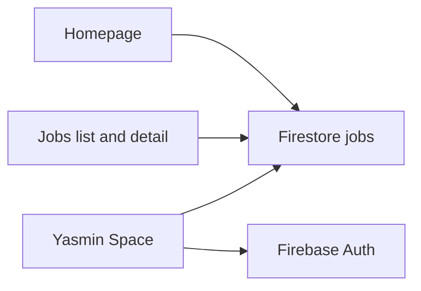

# HireFound platform plan

This file is the source of truth for the move from the vanilla site to Next.js. Update it in the same change that does the work. A pull request that moves the platform without updating this file is incomplete.

Historical specs in [`.kiro/specs/`](../.kiro/specs/) describe the vanilla site. They stay as history. Do not rewrite them. If a decision here disagrees with a `.kiro` spec, this file wins.

## Status

| | |
|---|---|
| Current phase | Phase 5 — Yasmin parity (in progress) |
| Next work | Dual review for high-risk auth + Tiptap, then Phase 5 gate |
| Last updated | 2026-10-06 |
| Live site | Vanilla HTML on GitHub Pages (`hirefound.com`) until Phase 6 |
| Reviews | Dual Cursor + `agy` at each phase gate, on high-risk items, and on every Phase 7 surface |

Status values used below: `not started`, `in progress`, `done`, `deferred`.

## How to update this file

- Change an item's status when work on it starts or finishes.
- Set **Current phase** and **Last updated** at the top in that same change.
- Commit each change on `v2` and push that branch. Do not put this work on `main` before Phase 6.
- Add a dated line to the decision log when a choice changes. Do not open a second plan.
- Leave Phase 7's visual direction blank until parity is done and a direction is chosen.
- Do not mark a **phase gate** or **high-risk item** `done` until Cursor and `agy` reviews are both checked. Ordinary checklist items do not each need dual review.

## Decision log

- **2026-10-06** — UI framework is Next.js (App Router) with React, Tailwind, and shadcn/ui.
- **2026-10-06** — Backend stays Firebase Auth and Cloud Firestore, client SDK only. No new backend and no hosted CMS.
- **2026-10-06** — Hosting stays GitHub Pages at `hirefound.com`. Next.js uses `output: 'export'`. At cutover, the workflow uploads the static `out/` folder.
- **2026-10-06** — Job list and job detail stay client-loaded from Firestore. Detail keeps the current `?id=` pattern so a new job works without a rebuild.
- **2026-10-06** — Yasmin's job form is rebuilt with shadcn. `fullDescription` and `fullDescriptionAr` move from Quill 2 to Tiptap and keep saving HTML.
- **2026-10-06** — Migration matches current behavior first. Visual redesign is Phase 7, after parity.
- **2026-10-06** — Implementation happens on branch `v2`, with each change committed and pushed there. `main` keeps serving the vanilla site until Phase 6.
- **2026-10-06** — Phase 7 UI/UX work is dual-reviewed: Cursor first, then Antigravity CLI (`agy`), using [`docs/ui-ux-review-prompt.md`](ui-ux-review-prompt.md). A surface is not `done` until both reviews are recorded.
- **2026-10-06** — Dual review also applies to every phase gate (Phases 1–6) and to named high-risk items, using [`docs/phase-review-prompt.md`](phase-review-prompt.md). Not every checkbox gets dual review.
- **2026-10-06** — Phase 1 `agy` asked for a `v2` lint/test/build CI workflow. Deferred as nice-to-have (not on the Phase 1 checklist). Draft lives at [`.github/workflows/ci.yml`](../.github/workflows/ci.yml); wire or extend it when PR checks are wanted.



## Locked decisions

- **Framework.** Next.js App Router, React, Tailwind, shadcn/ui.
- **Backend.** Firebase project `hire-found`. Auth and Firestore only, initialized in the browser the way [`js/firebase-config.js`](../js/firebase-config.js) does today. Firebase Hosting, Cloud Functions, and Storage are out of scope.
- **Hosting.** GitHub Pages, custom domain `hirefound.com`, `basePath` `/`. Static export settings: `output: 'export'`, `trailingSlash: true`, `images.unoptimized: true`. No Next.js server, API routes, or middleware. Those need a host change, which is a new decision.
- **Job URLs.** Public detail stays client-loaded (`/jobs/?id={slug}`), matching [`js/jobs.js`](../js/jobs.js). A path like `/jobs/some-new-role` is not a real file for jobs created after the last build, so it is not the live detail URL.
- **Editor.** shadcn form. Tiptap for the two long descriptions, `dir="rtl"` on the Arabic field. Short description stays plain text. Stored HTML in existing jobs must still render.
- **Where the work lives.** Branch `v2` until cutover. Each change is committed and pushed to `v2`. `main` stays the vanilla site until Phase 6.
- **Deploy until cutover.** [`.github/workflows/deploy.yml`](../.github/workflows/deploy.yml) keeps uploading the repo root. Do not point it at `out/` before Phase 6.

## Data contract

Collection: `jobs`. Do not rename fields during the migration.

| Field | Role |
|---|---|
| `title` | Required. English title. Max 120. |
| `titleAr` | Optional Arabic title. Max 120. |
| `slug` | Required. `[a-z0-9]+(-[a-z0-9]+)*`, max 80. Generated from `title`, then deduped. |
| `category` | Required. Max 50. Known values include hospitality, tech, fnb, aviation, retail, healthcare, education, finance, marketing, engineering, design, customer-service, logistics, real-estate, media. |
| `location` | Required. Max 100. Suggestions: Jordan, UAE, Saudi Arabia, Qatar, Kuwait, Bahrain, Oman, Egypt, Remote. |
| `employmentType` | Required. One of `full-time`, `part-time`, `contract`, `freelance`. |
| `shortDescription` | Optional plain text. Max 300. |
| `fullDescription` | Optional HTML from the rich-text editor. |
| `fullDescriptionAr` | Optional HTML. Rendered RTL when present. |
| `companyName` | Optional. Max 120. |
| `salary` | Optional display string. Max 100. |
| `contactWhatsApp` | Optional digits, 7–15. Default `962793001043`. |
| `contactEmail` | Optional email. Default `yasmin@hirefound.com`. |
| `tallyFormId` | Optional. When set, apply embeds that Tally form. |
| `createdAt` | Firestore server timestamp. Public list orders by this, descending. |
| `updatedAt` | Firestore server timestamp on edit. |
| `expiresAt` | Optional. Public fetch drops jobs whose `expiresAt` is in the past. |
| `isActive` | Public reads require `true`. Yasmin can read and toggle inactive jobs. |

Public query, from [`js/jobs.js`](../js/jobs.js): `isActive == true`, `orderBy createdAt desc`, optional limit (homepage uses 4), 10-second timeout, then drop expired jobs in the client.

Apply order on the public job: Tally iframe when `tallyFormId` is set, otherwise WhatsApp, email, and Book a Call. Booking link: `https://cal.com/yasminblasi`.

## Known fix

- [ ] **Firestore allowlist drift** — `not started`. [`firestore.rules`](../firestore.rules) allows read/write for `moh.noor94@gmail.com` only. [`yasmin/js/app.js`](../yasmin/js/app.js) also allows `yasmin@hirefound.com`. Fix this in Phase 6 so the UI allowlist and the rules match. Deploy the rules with `firebase-tools`. The GitHub Pages workflow does not deploy rules.

## Historical specs

These folders are the record of the current vanilla site. Leave them in place.

| Spec | What it recorded |
|---|---|
| [`.kiro/specs/jobs-feature/`](../.kiro/specs/jobs-feature/) | Live Firestore jobs on GitHub Pages |
| [`.kiro/specs/admin-job-panel/`](../.kiro/specs/admin-job-panel/) | Google-gated job CRUD |
| [`.kiro/specs/yasmin-admin-experience/`](../.kiro/specs/yasmin-admin-experience/) | Yasmin branding and the butterfly admin |
| [`.kiro/specs/admin-quality-of-life/`](../.kiro/specs/admin-quality-of-life/) | `/yasmin/`, quick links, shortcuts |
| [`.kiro/specs/unified-site-components/`](../.kiro/specs/unified-site-components/) | Shared nav, footer, and CSS without a framework |
| [`.kiro/specs/cal-com-integration/`](../.kiro/specs/cal-com-integration/) | Book-a-Call modal on the homepage |
| [`.kiro/specs/book-a-call-modal-consistency/`](../.kiro/specs/book-a-call-modal-consistency/) | One booking modal across CTAs |

## Review policy

Dual review means: Cursor first, then Antigravity CLI (`agy`), then fix agreed must-fixes, then check both boxes.

**What gets dual review**

1. **Phase gates** — end of Phases 1–6. A phase is not complete until its gate passes.
2. **High-risk items** — named below inside the phase they belong to (auth, Tiptap HTML, Firestore rules, static export / GH Pages).
3. **Phase 7 surfaces** — every redesign surface (existing rule).

**What does not**

- Ordinary checklist rows (nav, footer, individual filters, etc.). Those are covered by the phase gate.

**How to run `agy`**

```bash
# Phase / engineering gate
agy -p "$(sed 's/REPLACE_WITH_SCOPE/phase-1-gate/' docs/phase-review-prompt.md)" --effort high

# Phase 7 UI/UX surface
agy -p "$(sed 's/REPLACE_WITH_ONE_OF/homepage/' docs/ui-ux-review-prompt.md)" --effort high
```

Or paste the matching prompt into interactive `agy` and set the scope/surface name.

Record under the gate or item: date + one-line verdict (`pass` / `pass-with-fixes` / `fail`). Keep long critiques in the PR, not in this file.

## Phase 1 — Foundation

Branch `v2`. Static export only. No pages beyond a smoke route.

- [x] Next.js App Router app — `done`
- [x] Tailwind build (replace the Tailwind CDN) — `done`
- [x] shadcn/ui initialized — `done`
- [x] Firebase client module (app, Auth, Firestore), same project as [`js/firebase-config.js`](../js/firebase-config.js) — `done`
- [x] `output: 'export'`, `trailingSlash: true`, `images.unoptimized: true`, `basePath` `/` — `done`
- [x] Vitest running in the new app — `done`
- [x] `npm run build` writes `out/` and is not what GitHub Pages deploys yet — `done`

### High-risk

- [x] Static export config stays valid for GitHub Pages — `done`
  - [x] Cursor review — 2026-10-06 pass
  - [x] `agy` review — 2026-10-06 pass

### Phase 1 gate

- [x] Phase 1 gate — `done`
  - [x] Cursor review — 2026-10-06 pass-with-fixes (eslint ignore vanilla; vitest ESM config)
  - [x] `agy` review — 2026-10-06 pass-with-fixes (same; CI workflow deferred as nice-to-have)

- [ ] Optional: enable/extend [`.github/workflows/ci.yml`](../.github/workflows/ci.yml) for PR checks — `deferred`

## Phase 2 — Shared job domain

Port behavior, then the tests. Keep the data contract above.

- [x] Job type matching the Firestore fields — `done`
- [x] `fetchJobs` (active, newest first, limit, 10s timeout, drop expired) — `done`
- [x] Slug generate and dedupe, from [`yasmin/js/editor.js`](../yasmin/js/editor.js) — `done`
- [x] Form validation rules from `validateForm` — `done`
- [x] Category filter, search, and status filter used by the dashboard — `done`
- [x] Port [`yasmin/__tests__/slug.property.test.js`](../yasmin/__tests__/slug.property.test.js) — `done`
- [x] Port [`yasmin/__tests__/validation.property.test.js`](../yasmin/__tests__/validation.property.test.js) — `done`
- [x] Port [`yasmin/__tests__/dashboard-filters.test.js`](../yasmin/__tests__/dashboard-filters.test.js) — `done`
- [x] Port [`yasmin/__tests__/shortcuts.test.js`](../yasmin/__tests__/shortcuts.test.js) — `done`
- [x] Revisit the Book a Call tests when the modal is ported in Phase 3: [`__tests__/book-a-call-preservation.property.test.js`](../__tests__/book-a-call-preservation.property.test.js), [`__tests__/book-a-call-bug-condition.property.test.js`](../__tests__/book-a-call-bug-condition.property.test.js) — `done` (vanilla suite passes; React BookingModalProvider + CTAs covered in site-components.test.tsx)
- [ ] [`yasmin/__tests__/tailwind-config.property.test.js`](../yasmin/__tests__/tailwind-config.property.test.js) — `deferred`. It locks the CDN Tailwind config. Replace it with the new Tailwind setup instead of porting it.

### High-risk

- [x] Data contract + ported Vitest suite match vanilla behavior — `done`
  - [x] Cursor review — 2026-10-06 pass
  - [x] `agy` review — 2026-10-06 pass

### Phase 2 gate

- [x] Phase 2 gate — `done`
  - [x] Cursor review — 2026-10-06 pass
  - [x] `agy` review — 2026-10-06 pass

## Phase 3 — Public site parity

Match current behavior and layout. Visual redesign waits for Phase 7.

Sources: [`index.html`](../index.html), [`js/nav.js`](../js/nav.js), [`js/footer.js`](../js/footer.js), [`js/booking-modal.js`](../js/booking-modal.js).

- [x] Shared nav — `done`
- [x] Shared footer, including contact mailto — `done`
- [x] Hero, including the WhatsApp-style typing chat — `done`
- [x] Anti-pitch — `done`
- [x] Live vacancies (4 active jobs) — `done`
- [x] About — `done`
- [x] Services (employer / candidate) — `done`
- [x] How it works — `done`
- [x] Trust / testimonials, still hidden as on the current homepage — `done`
- [x] Book a Call modal (Cal.com embed, `cal.com/yasminblasi`) — `done`
- [x] WhatsApp entry points and floating actions — `done`
- [x] Scroll reveals — `done`
- [x] Custom cursor — `done`

### Phase 3 gate

- [x] Phase 3 gate (homepage parity vs live site) — `done`
  - [x] Cursor review — 2026-10-06 pass-with-fixes (services tab, hero timing, vacancies empty/filters, booking modal, ActionStack, metadata)
  - [x] `agy` review — 2026-10-06 pass-with-fixes (same must-fixes applied)

## Phase 4 — Jobs parity

Source: [`jobs/index.html`](../jobs/index.html), [`js/jobs.js`](../js/jobs.js).

- [x] Jobs list page — `done`
- [x] Category filters — `done`
- [x] Job cards — `done`
- [x] Detail via `?id=`, including back/forward — `done`
- [x] Empty, error, and not-found states — `done`
- [x] Apply: Tally iframe when `tallyFormId` is set — `done`
- [x] Apply fallback: WhatsApp, email, Book a Call — `done`
- [x] Arabic description block when `fullDescriptionAr` is set — `done`

### High-risk

- [x] Client-loaded detail (`?id=`) and apply paths — `done`
  - [x] Cursor review — 2026-10-06 pass
  - [x] `agy` review — 2026-10-06 pass

### Phase 4 gate

- [x] Phase 4 gate — `done`
  - [x] Cursor review — 2026-10-06 pass
  - [x] `agy` review — 2026-10-06 pass

## Phase 5 — Yasmin parity

Sources: [`yasmin/index.html`](../yasmin/index.html) and [`yasmin/js/`](../yasmin/js/). shadcn for the panel. Tiptap replaces Quill. Same Firestore writes (`addDoc`, `updateDoc`, `deleteDoc`, `serverTimestamp`).

- [x] Google sign-in, local persistence — `done`
- [x] Allowlist: `moh.noor94@gmail.com`, `yasmin@hirefound.com` — `done`
- [x] Loading, signed-out, and access-denied states — `done`
- [x] Sign out — `done`
- [x] Dashboard list of all jobs, including inactive — `done`
- [x] Search, category filter, status filter, counts — `done`
- [x] Active toggle, edit, delete (with confirm), view-on-site link — `done`
- [x] Greeting and subtitle — `done`
- [x] Quick links: homepage, jobs, Tally create, Cal.com — `done`
- [x] Editor sections: basic info, company, description, contact — `done`
- [x] Slug auto-generation, manual override, regenerate, dedupe — `done`
- [x] Tiptap for `fullDescription` and `fullDescriptionAr`, HTML in, HTML out — `done`
- [x] Arabic field RTL — `done`
- [x] Toasts — `done`
- [x] `N` shortcut opens a new job when the shortcut should not be suppressed — `done`

### High-risk

- [ ] Auth allowlist + denied states — `in progress`
  - [ ] Cursor review
  - [ ] `agy` review
- [ ] Tiptap HTML round-trip (existing Quill jobs still render) — `in progress`
  - [ ] Cursor review
  - [ ] `agy` review

### Phase 5 gate

- [ ] Phase 5 gate — `not started`
  - [ ] Cursor review
  - [ ] `agy` review

## Phase 6 — Cutover

Do this only after Phases 3–5 match the live site.

- [ ] Fix the Firestore allowlist drift and deploy the rules — `not started`
- [ ] GitHub Action builds the app and uploads `out/` — `not started`
- [ ] Vanilla `index.html`, `jobs/`, and `yasmin/` are no longer the deployed site — `not started`
- [ ] Smoke test: homepage vacancies load — `not started`
- [ ] Smoke test: open a job via `?id=` and an apply path — `not started`
- [ ] Smoke test: Yasmin sign-in, create, edit, and the public page shows the saved HTML — `not started`

### High-risk

- [ ] Firestore rules match the UI allowlist and are deployed — `not started`
  - [ ] Cursor review
  - [ ] `agy` review
- [ ] GH Pages workflow builds and deploys `out/` only — `not started`
  - [ ] Cursor review
  - [ ] `agy` review

### Phase 6 gate

- [ ] Phase 6 gate (production cutover ready) — `not started`
  - [ ] Cursor review
  - [ ] `agy` review

## Phase 7 — Design and UX

Start only after Phase 6. Pick the visual direction at the start of this phase and record it in the decision log. This list names the surfaces. It does not choose a look.

Use [`docs/ui-ux-review-prompt.md`](ui-ux-review-prompt.md). Each surface stays incomplete until **both** reviews are checked. Order: implement → Cursor review → `agy` critique → fix agreed issues → mark `done`.

### Surfaces

- [ ] Choose the visual direction and write it in the decision log — `not started`
- [ ] Public homepage pass — `not started`
  - [ ] Cursor review
  - [ ] `agy` review
- [ ] Jobs list and detail pass — `not started`
  - [ ] Cursor review
  - [ ] `agy` review
- [ ] Yasmin dashboard pass — `not started`
  - [ ] Cursor review
  - [ ] `agy` review
- [ ] Yasmin editor pass — `not started`
  - [ ] Cursor review
  - [ ] `agy` review
- [ ] Shared nav, footer, and booking modal pass — `not started`
  - [ ] Cursor review
  - [ ] `agy` review
