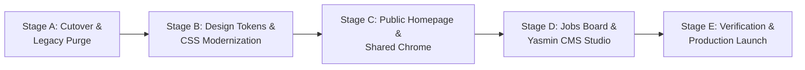

# Master Synthesis & Execution Blueprint: The HireFound Rebuild Strategy

**Document:** `rebuild/all01.md`  
**Date:** October 9, 2026  
**Status:** Unified Multi-Opinion Synthesis, Architectural Decision Record & Complete Execution Blueprint  
**Input Documents:** `opinion01.md`, `opinion02.md`, `opinion03.md`  
**Target Codebase:** `/Users/noor/Projects/hire-found` (Branch `v2`)  

---

## 1. Executive Summary & The Unified Strategic Verdict

### The Problem
Working on HireFound currently feels sluggish and tedious. An exhaustive multi-agent architectural audit confirms the root cause: **the project is caught in a "Frankenstein" mid-migration trap**. 

In the initial Next.js port (Phases 1–5), the site was built under a strict mandate for **1:1 bug-for-bug visual parity** with an older vanilla JavaScript prototype. This forced modern React 19 / Next.js code to act as an inert script loader for legacy DOM manipulation scripts (`document.getElementById`, `MutationObserver` on `document.body`, recursive `setTimeout` typing loops, and 1,500+ lines of custom CSS).

### The Master Verdict: The "Smart Rebuild" ("Cut, Then Skin")
The debate between full greenfield rebuilding, incremental vanilla patching, and strangler cutover has produced a **unanimous, conclusive strategy**:

```
                                      THE MASTER STRATEGY
                                      
     ❌ Naive Full Rebuild                 ⭐ THE SMART REBUILD                ❌ Incremental Parity
  (Burn everything to ground)             (Unified Synthesis)                (Keep fighting DOM hacks)
 ┌──────────────────────────────┐       ┌──────────────────────────────┐       ┌──────────────────────────────┐
 │ • Rewrites 189 green tests   │       │ 1. Cut over & delete legacy  │       │ • Keeps dual-tree tax        │
 │ • Risks Firestore data bugs  │ ───►  │ 2. Preserve tested engine    │ ◄───  │ • Keeps MutationObservers    │
 │ • Auth edge-case regressions │       │ 3. 100% rebuild UI & tokens  │       │ • Keeps hirefound.css        │
 │ • 4–6 weeks of wasted delay  │       │ 4. Pure declarative React 19 │       │ • Infinite whack-a-mole      │
 └──────────────────────────────┘       └──────────────────────────────┘       └──────────────────────────────┘
```

1. **Do NOT rebuild the domain, auth, or backend from scratch.** The **189 passing Vitest tests**, deployed **Firestore security rules**, robust **Google OAuth allowlist state machine**, **Arabic RTL support**, and **Quill-to-Tiptap HTML sanitizers** are production-grade assets. Throwing them away would be reckless.
2. **Do NOT keep patching the vanilla parity layer.** The legacy root folders (`/index.html`, `/js/`, `/css/`, `/jobs/`, `/yasmin/`) must be immediately retired and deleted.
3. **100% REBUILD the UI, styling, and component layer from the ground up.** Eliminate all imperative DOM effect files, custom cursor overrides, fake WhatsApp typing widgets, blob blur animations, and conflicting CSS stylesheets. Replace them with an elite, luxury executive recruitment design system built on **Tailwind v4 tokens**, **Radix UI primitives**, and **pure declarative React 19**.

---

## 2. Comprehensive Comparison of Opinion01, Opinion02, and Opinion03

| Dimension | `opinion01.md` (Technical & UX Deep-Dive) | `opinion02.md` (Hybrid-Strangler Audit) | `opinion03.md` (Debate & Operational Plan) | **Unified Master Synthesis (`all01.md`)** |
|---|---|---|---|---|
| **Core Philosophy** | **Smart Rebuild:** Rebuild 100% of UI/UX, preserve backend/domain core. | **Hybrid-Strangler:** Finish Phase 6 cutover; do not start from scratch. | **"Cut, Then Skin":** Finish cutover, delete vanilla tree, then aggressively redesign. | **The Smart Rebuild ("Cut, Then Skin"):** Sequenced cutover + legacy purge, followed by an uncompromising UI rebuild. |
| **Why Fixes Feel Tedious** | Frankenstein architecture: React fighting DOM mutations & `MutationObserver`. | Dual-stack maintenance tax: every change must be mirrored across two trees. | "Mid-migration + Parity constraint": artificially forced to clone an old prototype. | **Combined Root Cause:** Dual-tree overhead + imperative DOM scripts inside React shells. |
| **Routing & SEO Strategy** | Demands immediate dynamic path routing (`/jobs/[slug]`) for OpenGraph & JSON-LD. | Keeps `/jobs/?id=` to preserve GitHub Pages static export (`output: 'export'`). | Keeps `/jobs/?id=` for initial Phase 7; defers path routes to a dedicated hosting decision. | **Hybrid Prudence:** Keep `/jobs/?id=` for static export launch with SPA fallback; add OpenGraph metadata on `/jobs/`. |
| **Component Architecture** | Rigorous breakdown of the 4 `*-effects.tsx` files, polling modals, and custom cursor. | Highlights build-time Tailwind v4 and single npm Firebase SDK vs CDN ESM drift. | Establishes product requirements: Yasmin as an operator tool (<2 min publish), brand-first public fold. | **Clean Architecture:** Delete all 4 effect files, replace ad-hoc modals with Radix Dialog, unify Tailwind tokens. |
| **Aesthetic Direction** | Boutique Executive Advisory (Linen, Deep Burgundy, Warm Gold, Editorial Typography). | Consolidate to `src/components/ui` + single Tailwind v4 `@theme`. | Brand-first first viewport, high-density admin table, unhidden social proof. | **Boutique Executive Firm Aesthetic:** High-trust editorial marketing + high-density recruiter CMS. |

---

## 3. The Tri-Partite Audit: Delete vs. Preserve vs. Rebuild

```
┌─────────────────────────────────────────────────────────────────────────────────────────────────┐
│ 1. WHAT WE DELETE (Eliminating 8,500+ LOC of Legacy Debt)                                      │
├─────────────────────────────────────────────────────────────────────────────────────────────────┤
│ • Legacy root folders: /index.html (78KB), /js/ (100KB), /jobs/, /yasmin/, /css/shared.css       │
│ • Imperative DOM bridge files: hero-effects.tsx, micro-interactions.tsx,                        │
│   scroll-reveals.tsx, services-effects.tsx                                                      │
│ • Custom cursor hack: custom-cursor.tsx and body * { cursor: none !important }                 │
│ • Simulated WhatsApp hero widget with fake typing dots & reply bar                              │
│ • Ad-hoc modal implementation with 40x setInterval polling in booking-modal.tsx                │
│ • Legacy stylesheets: src/app/hirefound.css (534 lines) and src/app/yasmin/yasmin.css (239 lines)│
└─────────────────────────────────────────────────────────────────────────────────────────────────┘
                                                │
                                                ▼
┌─────────────────────────────────────────────────────────────────────────────────────────────────┐
│ 2. WHAT WE PRESERVE (The Battle-Tested Production Engine)                                      │
├─────────────────────────────────────────────────────────────────────────────────────────────────┤
│ • All 189 passing Vitest tests across 24 test suites (src/lib/**/*.test.ts)                     │
│ • Firestore Security Rules (firestore.rules) with verified public active reads & admin writes   │
│ • Set-equality automated sync test (src/lib/yasmin/firestore-rules.test.ts)                    │
│ • Resilient Firebase Auth state machine (src/hooks/use-admin-auth.ts) with popup/incognito fixes │
│ • Quill ↔ Tiptap rich-text converter & HTML sanitizer (src/lib/yasmin/editor-html.ts)           │
│ • Bilingual Arabic RTL text handling (dir="rtl", lang="ar") and validation helpers              │
│ • Deterministic slug engine (src/lib/jobs/slug.ts) with collision deduplication                │
└─────────────────────────────────────────────────────────────────────────────────────────────────┘
                                                │
                                                ▼
┌─────────────────────────────────────────────────────────────────────────────────────────────────┐
│ 3. WHAT WE REBUILD (The Fresh High-End System)                                                  │
├─────────────────────────────────────────────────────────────────────────────────────────────────┤
│ • Single Tailwind v4 design token architecture in src/app/globals.css                           │
│ • High-end boutique executive identity (Linen, Bordeaux Burgundy, Warm Gold, Editorial Serif)  │
│ • Declarative React 19 marketing homepage with clear dual-track Employer / Candidate journeys   │
│ • Unhidden, authoritative social proof (TEDx, Leaders of Arabia, client executive testimonials)│
│ • Accessible Radix UI Dialog for instant Cal.com booking                                        │
│ • Fast, filterable public jobs board with clean typography and Tally application fallbacks     │
│ • High-density Yasmin CMS workspace (<2 minutes to publish a role with Zod validation)          │
└─────────────────────────────────────────────────────────────────────────────────────────────────┘
```

---

## 4. Master Design System & Architectural Blueprint

```
Target Architecture (Clean Declarative Next.js 15 / React 19):
┌────────────────────────────────────────────────────────────────────────┐
│ Next.js App Router (React 19 Server & Client Components)               │
│                                                                        │
│ ├── app/                                                               │
│ │   ├── layout.tsx             (Global Layout, Font Tokens, Toaster)   │
│ │   ├── globals.css            (Tailwind v4 @theme Tokens & Utilities) │
│ │   ├── page.tsx               (RSC: Homepage with Persona Switcher)   │
│ │   ├── jobs/                                                          │
│ │   │   ├── page.tsx           (RSC: Filterable Directory + URL State) │
│ │   │   └── not-found.tsx      (Clean 404 State)                       │
│ │   └── yasmin/                                                        │
│ │       ├── page.tsx           (Admin Dashboard with Auth Protection)  │
│ │       └── new / [id]/        (Type-Safe Job Management Studio)       │
│ │                                                                      │
│ ├── components/                                                        │
│ │   ├── ui/                    (Tailwind v4 + Radix UI Primitives)     │
│ │   ├── site/                  (Hero, PersonaSwitcher, Services, Trust)│
│ │   ├── jobs/                  (JobCard, FilterBar, ApplyModal)        │
│ │   └── yasmin/                (DashboardTable, TiptapEditor, Forms)   │
│ │                                                                      │
│ ├── lib/                                                               │
│ │   ├── jobs/                  (Preserved Domain Logic, Slugs, Filters)│
│ │   ├── yasmin/                (Preserved HTML Sanitizer, Auth Config) │
│ │   └── firebase.ts            (Firebase Client Config)                │
└────────────────────────────────────────────────────────────────────────┘
```

### A. Visual Brand Identity & Tokens
HireFound is positioned as an **elite boutique executive search and career advisory firm** led by Yasmin Blasi. The aesthetic avoids amateur tech tropes (custom cursors, fake WhatsApp widgets, neon blobs) and embraces **monolithic, editorial luxury**.

* **Palette Tokens (`src/app/globals.css`):**
  * `Primary (Bordeaux Burgundy)`: `oklch(0.35 0.12 10)` (`#7A1E4A`) — Trust, executive leadership.
  * `Secondary (Warm Gold / Ochre)`: `oklch(0.72 0.10 65)` (`#D4A574`) — Prestige, warmth.
  * `Background (Warm Linen)`: `oklch(0.985 0.01 75)` (`#FCF9F5`) — Editorial calm, high readability.
  * `Surface (Card White)`: `oklch(1 0 0)` (`#FFFFFF`) — Crisp contrast and clear structure.
  * `Text (Charcoal Espresso)`: `oklch(0.20 0.02 50)` (`#1F1D1B`) — High-contrast legibility.
* **Typography:**
  * **Headings:** Playfair Display / DM Serif Display (editorial authority).
  * **Body:** Inter / Geist Sans (crisp, modern legibility).
  * **Arabic:** Noto Sans Arabic (seamless bidirectional balance).

---

## 5. Surface-by-Surface Redesign Specifications

### Surface 1: Public Homepage (`src/app/page.tsx`)
1. **Hero Section:**
   * Replace the fake WhatsApp typing box with an **authoritative executive value proposition**:
     * Headline: *"Matchmakers for Meaningful Careers."*
     * Subtitle: *"Executive search and bespoke recruitment across the Gulf and MENA region, curated by Yasmin Blasi."*
     * Yasmin’s professional portrait integrated with a subtle warm aura (no heavy rotating blobs).
     * Two distinct, clear CTA pathways: **"I'm Hiring Executive Talent"** (opens consultation/booking) vs **"Explore Open Roles"** (jumps to live vacancies).
2. **Services & Persona Switcher:**
   * Replace manual DOM click listeners with declarative **Radix UI Tabs** (`@radix-ui/react-tabs`).
   * Clean tabs for **For Employers** (Executive Search, Retained Recruitment, Team Scaling) vs **For Candidates** (Career Advisory, Executive Placement, CV Transformation).
3. **Social Proof & Authority (Unhide & Redesign `Trust.tsx`):**
   * Unhide the press and media feature ticker: *TEDx Zarqa University*, *Leaders of Arabia*, *Arab Icons*.
   * Add executive testimonials with company names, client titles, and clean quote cards.
4. **Live Vacancies Section:**
   * Dynamic live jobs feed displaying the top 4 active listings with category badges, salary tags, and direct view actions.

---

### Surface 2: Shared Chrome & Modals
1. **`SiteNav`:**
   * Clean, backdrop-blur floating navigation with pre-colored HireFound logo, navigation links, and a prominent **"Book a Consultation"** button.
   * Responsive mobile drawer built with Radix Dialog.
2. **`SiteFooter`:**
   * High-contrast dark charcoal footer with direct WhatsApp quick-link, email contact, Cal.com trigger, and copyright.
3. **`BookingModal` (Radix UI Replacement):**
   * Delete the 397-line imperative implementation in `booking-modal.tsx`.
   * Implement a clean **Radix Dialog** that lazy-loads the Cal.com embed (`cal.com/yasminblasi`) with zero `setInterval` polling hacks, native focus trapping, and instant Escape key dismiss.

---

### Surface 3: Public Jobs Hub (`src/app/jobs/page.tsx`)
1. **Jobs Directory View:**
   * Refined category filter pills with instant filtering.
   * Search input with debounce for real-time title/location matching.
   * High-scanability job cards displaying Title, Arabic Title (if present), Category, Location, Employment Type, and Salary.
2. **Job Detail View & Apply Drawer:**
   * Clean detail layout rendered via client slug matching (`/jobs/?id=slug`).
   * Seamless bilingual Arabic description block with native `dir="rtl"` support.
   * Multi-channel application pathways: **Tally Form Embed** (when `tallyFormId` exists), direct **WhatsApp Apply**, **Email Apply**, or **Book a Call**.

---

### Surface 4: Yasmin CMS Space (`src/app/yasmin/page.tsx`)
1. **Executive Recruiter Dashboard:**
   * Clean, high-density command center tailored for a solo recruiter.
   * Key metric counters: *Total Jobs, Active Listings, Inactive/Archived*.
   * Fast search bar, category filters, and instant active/inactive toggle switch.
   * Keyboard shortcut `N` to immediately open a new job draft.
2. **Job Editor Studio (`job-editor.tsx`):**
   * Structured form using **React Hook Form + Zod schema validation**.
   * Instant slug auto-generation from title with manual override and deduplication.
   * Category and Location chip pickers.
   * **Tiptap Rich-Text Editor:** Clean toolbar (Bold, Italic, Underline, Bullet List, Ordered List, Link) with full Arabic RTL support and verified Quill 2 HTML normalization via `src/lib/yasmin/editor-html.ts`.

---

## 6. Phased Execution Plan & Milestones



### Stage A: Cutover & Legacy Purge (Immediate)
- [ ] Confirm Firestore security rules are deployed (`npm run firebase:deploy-rules`).
- [ ] Verify GitHub Actions workflow (`.github/workflows/deploy.yml`) builds Next.js export (`out/`).
- [ ] Merge `v2` into `main` and set GitHub Pages source to GitHub Actions.
- [ ] **Delete legacy root directories:** `/index.html`, `/js/`, `/jobs/`, `/yasmin/`, `/css/`.
- [ ] Remove ESLint `globalIgnores` for deleted folders; verify `npm test` and `npm run build` pass.

### Stage B: Design Tokens & CSS Modernization
- [ ] Configure the luxury boutique palette in `src/app/globals.css` using Tailwind v4 `@theme`.
- [ ] Setup font variables (Editorial Serif + Clean Sans + Noto Arabic) in `src/app/layout.tsx`.
- [ ] Delete `src/app/hirefound.css` and `src/app/yasmin/yasmin.css`.
- [ ] Delete `src/components/site/custom-cursor.tsx`.

### Stage C: Public Homepage & Shared Chrome
- [ ] Rebuild `SiteNav` and `SiteFooter` with clean responsive drawer and backdrop blur.
- [ ] Rebuild `BookingModal` using `@radix-ui/react-dialog` for Cal.com embed.
- [ ] Rebuild `Hero` section with executive headline, dual pathways, and portrait integration.
- [ ] Rebuild `Services` section using Radix Tabs.
- [ ] Unhide and style `Trust` section with media features and client reviews.
- [ ] Delete `hero-effects.tsx`, `services-effects.tsx`, `scroll-reveals.tsx`, and `micro-interactions.tsx`.

### Stage D: Jobs Hub & Yasmin CMS Studio
- [ ] Rebuild `/jobs` directory with instant category filter pills and search bar.
- [ ] Rebuild `JobCard` and `JobDetail` with clean typography and bilingual Arabic RTL support.
- [ ] Rebuild `/yasmin` dashboard with high-density table, quick filters, and status switches.
- [ ] Rebuild `JobEditor` using Zod validation, retaining `src/lib/yasmin/editor-html.ts`.

### Stage E: Verification & Final Launch
- [ ] Run full Vitest suite (`npm test`) — confirm all 189 tests pass.
- [ ] Run production build (`npm run build`) — verify static export compiles in under 3 seconds.
- [ ] Conduct live smoke tests: homepage vacancies load, job detail opens via `?id=`, Yasmin login & editor save HTML correctly.

---

## 7. Risk Mitigation & Quality Checklist

* [ ] **Zero Data Loss:** Existing Quill 2 job posts in Firestore render bullet lists and formatting perfectly in the new Tiptap editor.
* [ ] **Zero Security Regressions:** `firestore.rules` and `ALLOWED_EMAILS` allowlist remain strictly in sync.
* [ ] **Zero Side-Effect Scripts:** No `MutationObserver`, `document.getElementById`, or `setInterval` polling remains in any component.
* [ ] **Performance & Accessibility:** Lighthouse score ≥ 95 on mobile and desktop; all interactive touch targets ≥ 44x44px; full keyboard accessibility.
