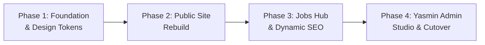

# Strategic Assessment: HireFound Ground-Up UI/UX Rebuild vs. Incremental Refactoring

**Document:** `rebuild/opinion01.md`  
**Date:** October 9, 2026  
**Status:** Comprehensive Analysis, Multi-Agent Debate Findings & Execution Blueprint  
**Target Codebase:** `/Users/noor/Projects/hire-found` (Branch `v2`)  

---

## 1. Executive Summary & Strategic Verdict

### The Core Problem
The team currently feels that making fixes to HireFound is tedious and sluggish. An in-depth technical audit reveals the exact root cause: **the codebase is currently in a "Frankenstein" hybrid state**. 

During the initial migration to Next.js (Phases 1–5), the site was ported with a strict mandate for **1:1 bug-for-bug visual parity** with an older vanilla JavaScript prototype. Rather than building declarative React 19 components, the codebase wrapped legacy imperative DOM scripts (`document.getElementById`, `MutationObserver` on `document.body`, recursive `setTimeout` typing loops, and 1,500+ lines of custom CSS) inside React component shells that return `null` or raw markup.

### The Strategic Verdict: The "Smart Rebuild"
Neither an ideological full wipe (throwing away the database, rules, and tests) nor blind incremental patching (fighting imperative DOM scripts) is optimal:

```
                                  THE STRATEGIC SPECTRUM
                                  
     ❌ Naive Full Rebuild               ⭐ THE SMART REBUILD              ❌ Blind Patching
  (Burn everything to the ground)      (Fresh UI/UX + Proven Engine)      (Keep fighting DOM hacks)
 ┌──────────────────────────────┐    ┌──────────────────────────────┐    ┌──────────────────────────────┐
 │ • Rewrites 189 passing tests │    │ • 100% Brand-New UI/UX       │    │ • Keeps MutationObservers    │
 │ • Risks Firestore data bugs  │    │ • Pure Declarative React 19  │    │ • Keeps hirefound.css        │
 │ • Auth edge-case regressions │ ──►│ • Unified Tailwind v4 Tokens │◄── │ • Keeps Fake WhatsApp Hero   │
 │ • 4–6 weeks of wasted time   │    │ • Dynamic /jobs/[slug] SEO   │    │ • High mental friction       │
 │                              │    │ • Retains Tested Auth & Data │    │ • Tedious to maintain        │
 └──────────────────────────────┘    └──────────────────────────────┘    └──────────────────────────────┘
```

1. **Rebuild 100% of the UI, Design System, and Component Layer from Scratch:**
   - Eliminate legacy DOM side-effect files, custom cursor overrides, fake WhatsApp typing widgets, blob blur animations, and conflicting CSS files.
   - Implement an elite boutique executive recruitment design system using **Tailwind v4 tokens**, **Radix UI primitives**, and **declarative React 19**.
   - Upgrade `/jobs` from client query parameters (`/jobs/?id=slug`) to dynamic routes (`/jobs/[slug]`) with rich OpenGraph preview cards and Google `JobPosting` JSON-LD schema.
2. **Preserve and Import the Battle-Tested Domain & Data Engine:**
   - Retain the **189 passing Vitest tests**, deployed **Firestore security rules**, robust **Google OAuth allowlist state machine**, **Arabic RTL support**, and **Quill-to-Tiptap HTML sanitization algorithms**.

---

## 2. Deep-Dive Codebase Findings & Audit

```
Current Architecture (Anti-Pattern Hybrid):
┌────────────────────────────────────────────────────────────────────────┐
│ React Shell (Next.js 16 / React 19)                                    │
│ ┌────────────────────────────────────────────────────────────────────┐ │
│ │ <HeroEffects />         -> Returns null, document.getElementById() │ │
│ │ <MicroInteractions />   -> MutationObserver(document.body) polling │ │
│ │ <ScrollReveals />       -> MutationObserver(document.body) polling │ │
│ │ <ServicesEffects />     -> document.addEventListener('click')      │ │
│ │ <CustomCursor />        -> body * { cursor: none !important }     │ │
│ │ <BookingModal />        -> setInterval() 40x polling for iframe    │ │
│ └────────────────────────────────────────────────────────────────────┘ │
│                               ▲                                        │
│                               │ Direct DOM Mutation & Class Toggling   │
│                               ▼                                        │
│ Static Ported CSS (hirefound.css: 534 lines, yasmin.css: 239 lines)   │
│ Legacy Artifacts in Root (/index.html: 78KB, /js/: 100KB, /css/)      │
└────────────────────────────────────────────────────────────────────────┘
```

### A. Technical Debt in the Component Layer
1. **Side-Effect Bridge Components (`src/components/site/*-effects.tsx`):**
   - `hero-effects.tsx`: Direct `document.getElementById` and recursive `setTimeout` typing loop that mutates `typingText.textContent` outside React's virtual DOM.
   - `micro-interactions.tsx`: Attaches a global `MutationObserver` on `document.body` (`observer.observe(document.body, { childList: true, subtree: true })`) to bind magnetic mousemove handlers to `.magnetic` and `.premium-card` nodes.
   - `scroll-reveals.tsx`: Attaches a second `MutationObserver` on `document.body` and hardcodes element IDs (`#steps-grid`) with manual class injections.
   - `services-effects.tsx`: Intercepts clicks on `document.addEventListener("click")` and manually manipulates styles (`opacity`, `transform`, `display: none`) on DOM nodes rather than using React state.
2. **Ad-Hoc Modal & Polling Hacks:**
   - `src/components/site/booking-modal.tsx` (397 lines) implements a manual focus trap with custom keyboard arithmetic, manually sets `document.body.style.overflow = "hidden"`, and **polls with `setInterval` every 200ms up to 40 times (8 seconds)** checking `document.querySelector("#booking-cal-container iframe")`. This is completely redundant given `@radix-ui/react-dialog` is already installed.
3. **Accessibility-Breaking Cursor Overrides:**
   - `src/components/site/custom-cursor.tsx` and `src/app/hirefound.css` (Line 200: `body:has(.custom-cursor.active) * { cursor: none !important; }`) hide native hardware cursors across all DOM nodes, introducing noticeable input lag, breaking native link pointer states, and creating accessibility barriers.
4. **CSS Sprawl & Variable Drift:**
   - `src/app/hirefound.css` (534 lines) and `src/app/yasmin/yasmin.css` (239 lines) declare conflicting color variables (`--primary: #8B2252` in `hirefound.css` vs `#7A1E4A` in `globals.css`). `globals.css` also has duplicate declarations (`--color-muted` and `--color-secondary`).

---

### B. UI/UX & Brand Weaknesses
1. **The Simulated WhatsApp Hero:**
   - The hero section in `Hero.tsx` centers around a fake dark-mode WhatsApp chat box with animated typing dots. For an executive search and boutique recruitment brand, this looks like a generic tech widget and forces users to wait 2.5 seconds before reading the copy. Clicking "Send" merely redirects to `wa.me` with URL parameters.
2. **Disconnected Admin Space (`/yasmin`):**
   - The admin panel uses floating sparkles (`✨🦋💜🌸💫`), lavender gradient orbs, and handwritten `Caveat` script font, creating a stark visual disconnect from the public recruitment site.
3. **Hidden Social Proof:**
   - `src/components/site/sections/Trust.tsx` (Line 3: `<section id="trust" className="... hidden">`) hardcodes the entire press feature section (*TEDx Zarqa University, Leaders of Arabia, client testimonials*) to `hidden`, hiding valuable social proof from potential clients.
4. **Client-Side SPA Query Routing:**
   - Public job listings use `/jobs/?id=role-slug` with client-only fetching (`fetchJobs()` in `useEffect`). Consequently, links shared on LinkedIn or WhatsApp do not generate rich OpenGraph preview cards, and Google cannot index them via `JobPosting` structured data.

---

### C. What is Solid, Verified, and Must Be Preserved

| Asset | Location | Key Value |
|---|---|---|
| **189 Vitest Tests** | `__tests__`, `src/lib/**/*.test.ts` | 24 test suites passing in 1.1s covering domain rules, validation, slugs, and shortcuts. |
| **Firestore Security Rules** | `firestore.rules`, `src/lib/yasmin/firestore-rules.test.ts` | Enforces admin write protection (`ALLOWED_EMAILS`) and verified active-job public reads. |
| **Auth State Machine** | `src/hooks/use-admin-auth.ts` | Handles popup blockers, incognito storage fallbacks, and auth lifecycle race conditions. |
| **Quill ↔ Tiptap HTML Sanitizer** | `src/lib/yasmin/editor-html.ts` | Handles Quill 2 list serialization (`<ol><li data-list="bullet">` → `<ul>`), empty paragraph collapsing, and attribute cleanup. |
| **Arabic RTL Support** | `src/lib/jobs`, `src/components/yasmin` | Bidirectional text handling (`dir="rtl"`, `lang="ar"`) and dual-field validation. |
| **Deterministic Slug Engine** | `src/lib/jobs/slug.ts` | Sanitizes URLs and deduplicates collisions (`-2`, `-3`). |

---

## 3. The Multi-Agent Debate

```
┌─────────────────────────────────────────────────────────────────────────────────────────────────┐
│ REBUILD ADVOCATE & UI/UX VISIONARY SUBAGENT                                                     │
├─────────────────────────────────────────────────────────────────────────────────────────────────┤
│ "The current implementation is an awkward wrapper around a vanilla prototype. Direct DOM       │
│ mutations, MutationObservers, and custom cursor hacks make it painful to maintain. A fresh     │
│ declarative UI with dynamic /jobs/[slug] routes and Tailwind v4 tokens will give Yasmin an      │
│ elite, high-converting digital platform that reflects the prestige of her executive search."   │
└─────────────────────────────────────────────────────────────────────────────────────────────────┘
                                                ▲
                                                │ DEBATE & SYNTHESIS
                                                ▼
┌─────────────────────────────────────────────────────────────────────────────────────────────────┐
│ INCREMENTAL REFACTOR & RISK ANALYST SUBAGENT                                                    │
├─────────────────────────────────────────────────────────────────────────────────────────────────┤
│ "Beware the Second-System Effect. 189 tests already pass, Firestore rules are synchronized,     │
│ and Quill-to-Tiptap data normalization is verified. Discarding the domain engine risks data    │
│ corruption and weeks of delays. Keep the proven domain core and modernize the UI surgically."  │
└─────────────────────────────────────────────────────────────────────────────────────────────────┘
```

**Synthesis:** Both subagents are correct in their respective domains. The Rebuild Advocate accurately identifies the frontend UI/UX and component layer as fundamentally flawed, while the Risk Analyst accurately identifies the domain, auth, and data-integrity layer as production-grade and essential to preserve.

---

## 4. The Future Architecture & Design Blueprint

```
Target Architecture (Clean Declarative Next.js 15 / React 19):
┌────────────────────────────────────────────────────────────────────────┐
│ Next.js App Router (React 19 Server & Client Components)               │
│                                                                        │
│ ├── app/                                                               │
│ │   ├── layout.tsx             (Global Layout, Font Variables, Sonner) │
│ │   ├── globals.css            (Tailwind v4 Theme Tokens & Utilities)  │
│ │   ├── page.tsx               (RSC: Homepage with Persona Switcher)   │
│ │   ├── jobs/                                                          │
│ │   │   ├── page.tsx           (RSC: Filterable Directory + URL State) │
│ │   │   └── [slug]/                                                    │
│ │   │       ├── page.tsx       (RSC: Job Detail + JSON-LD + OG Meta)   │
│ │   │       └── not-found.tsx  (Clean 404 state)                       │
│ │   └── yasmin/                                                        │
│ │       ├── page.tsx           (Admin Dashboard with Auth Protection)  │
│ │       └── new / [id]/        (Type-Safe Job Management)              │
│ │                                                                      │
│ ├── components/                                                        │
│ │   ├── ui/                    (Tailwind v4 + Radix UI Primitives)     │
│ │   ├── site/                  (Hero, PersonaSwitcher, Services, Trust)│
│ │   ├── jobs/                  (JobCard, FilterBar, ApplyModal)        │
│ │   └── yasmin/                (DashboardTable, TiptapEditor, Forms)   │
│ │                                                                      │
│ ├── lib/                                                               │
│ │   ├── jobs/                  (Preserved Domain Logic, Slugs, Filters)│
│ │   ├── yasmin/                (Preserved HTML Sanitizer, Auth Config) │
│ │   └── firebase.ts            (Firebase Client Config)                │
└────────────────────────────────────────────────────────────────────────┘
```

### A. Brand Identity & Visual Language
* **Aesthetic Direction:** Boutique Executive Advisory & Headhunting (Warm Linen, Deep Bordeaux Burgundy, Warm Ochre Gold, Charcoal Espresso).
* **Typography Hierarchy:** Playfair Display / DM Serif for editorial authority paired with Inter / Geist for crisp body legibility.
* **Palette Tokens (OKLCH):**
  * `Primary (Burgundy / Bordeaux)`: `oklch(0.35 0.12 10)` (#7A1E4A)
  * `Secondary (Warm Gold / Ochre)`: `oklch(0.72 0.10 65)` (#D4A574)
  * `Background (Warm Linen)`: `oklch(0.985 0.01 75)` (#FCF9F5)
  * `Surface (Pure Card White)`: `oklch(1 0 0)` (#FFFFFF)
  * `Text (Charcoal Espresso)`: `oklch(0.20 0.02 50)` (#1F1D1B)

### B. Core UI Components to Rebuild
1. **Hero Section:**
   - Replace the fake WhatsApp typing box with an **editorial value proposition**, dual persona pathways (**"I'm Hiring Executive Talent"** vs **"Explore Open Careers"**), and an instant **Book a Consultation** action.
2. **Services & Persona Switcher:**
   - Replace manual DOM event listeners with declarative **Radix UI Tabs** and fluid spring transitions.
3. **Social Proof & Testimonials:**
   - Unhide and modernize the press features (*TEDx, Leaders of Arabia*) with a refined logo ticker and clean executive testimonial cards.
4. **Booking & Consultation Modal:**
   - Replace the 397-line polling hack with a standard **Radix UI Dialog** embedding the Cal.com scheduler cleanly.
5. **Jobs Hub & Dynamic SEO:**
   - Implement dynamic route `/jobs/[slug]` with `generateMetadata` for dynamic OpenGraph preview cards and Google `JobPosting` JSON-LD schema.
6. **Yasmin Admin Studio:**
   - Unify the CMS visual design with the public brand, implementing **Zod + React Hook Form** validation and clean Tiptap rich-text editing with RTL Arabic support.

---

## 5. Phased Execution Roadmap



### Phase 1: Foundation & Design Tokens (Day 1)
- [ ] Configure Tailwind CSS v4 design tokens in `src/app/globals.css`.
- [ ] Setup typography variables (Editorial Serif + Clean Sans) in `src/app/layout.tsx`.
- [ ] Install and verify Radix UI primitives (`@radix-ui/react-dialog`, `@radix-ui/react-tabs`, `@radix-ui/react-dropdown-menu`).
- [ ] Purge legacy static folders (`/index.html`, `/js/`, `/css/`, `/jobs/`, `/yasmin/`).

### Phase 2: Public Site Rebuild (Day 2)
- [ ] Rebuild `SiteNav` with clean responsive drawer and desktop glass effect.
- [ ] Rebuild `Hero` with executive headline, portrait integration, and clear dual CTAs.
- [ ] Rebuild `Services` using Radix Tabs for Employer vs Candidate journeys.
- [ ] Unhide and style `Trust` section with media features and client reviews.
- [ ] Rebuild `BookingModal` using Radix Dialog + Cal.com embed.
- [ ] Delete `hero-effects.tsx`, `services-effects.tsx`, `scroll-reveals.tsx`, `micro-interactions.tsx`, and `custom-cursor.tsx`.
- [ ] Delete `src/app/hirefound.css`.

### Phase 3: Jobs Hub & SEO Rebuild (Day 3)
- [ ] Rebuild `/jobs` directory with instant category filter pills and search.
- [ ] Implement dynamic route `/jobs/[slug]` with Server-Side Rendering / Static Export generation.
- [ ] Add `generateMetadata` for WhatsApp/LinkedIn OpenGraph sharing cards.
- [ ] Add Google `JobPosting` JSON-LD schema generator.
- [ ] Rebuild `JobCard` and `JobDetail` with clean typography and bilingual Arabic RTL support.

### Phase 4: Yasmin Admin Studio & Production Cutover (Day 4)
- [ ] Rebuild `/yasmin` dashboard with unified executive styling, stat cards, and job table.
- [ ] Rebuild `JobEditor` using Zod schema validation and React Hook Form while retaining `src/lib/yasmin/editor-html.ts`.
- [ ] Delete `src/app/yasmin/yasmin.css`.
- [ ] Run complete Vitest test suite (`npm test`) and production build (`npm run build`).
- [ ] Merge `v2` into `main` and deploy.

---

## 6. Verification & Risk Mitigation Checklist

* [ ] **Test Suite Health:** All 189 tests in `npm test` continue to pass without regressions.
* [ ] **Build Integrity:** `npm run build` generates clean static exports in `out/`.
* [ ] **Data Safety:** Tiptap editor correctly loads and saves existing Quill 2 Firestore job posts without corrupting lists or formatting.
* [ ] **Security Enforcement:** `firestore.rules` and `ALLOWED_EMAILS` set-equality test passes.
* [ ] **No Imperative DOM Scripts:** Zero `MutationObserver` or `document.getElementById` calls remain in component files.
* [ ] **Mobile & Accessibility:** All interactive elements have min 44x44px touch targets and native keyboard navigation.
