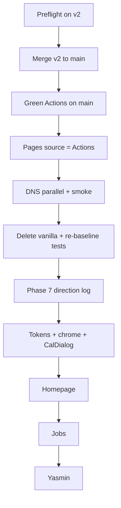

# HireFound — ultimate-final (canonical start doc)

**Document:** `rebuild/ultimate-final.md`  
**Date:** 2026-10-09  
**Status:** Canonical — the law for cutover + Phase 7. Self-contained; do not require prior rebuild docs to execute  
**Living phase checklist:** `docs/platform-plan.md` (update it when work lands)  
**Debate trail (do not drive work from these):** `rebuild/archive/`  
**Preflight recorded:** 2026-10-09 on `v2` — `npm test` 189/189 pass; `npm run build` green

---

## 0. How three “which rev is best?” opinions were reconciled

| Opinion | Verdict | What it got right | What it got wrong |
|---------|---------|-------------------|-------------------|
| **(1) Prior agent** | Best *review* = rev05; build from rev04 with agy caveat | Honesty on `agy` deferred; merge-first; assets sacred | Undersold rev04 as the executable spine |
| **(2)** | Best overall = **rev04**; rev06 as preflight; rev05 weakest | Standalone utility / Stage D detail; merge-first already in rev04 | Claimed reviews “completely unified”; ignored rev04’s false “agy APPROVED” row |
| **(3)** | Best *to trust* = **rev06**; build from rev04 after striking agy | Correct disqualification of rev04 as sole truth; same merge-first + defer-agy | Slightly overrates rev06 vs rev05 (they are peer agreement sheets) |

### Final meta-verdict

**Canonical executable = this file (`ultimate-final.md`).**

Construction rule (all three opinions agree once combined):

> **Take rev04’s full Stage A–E blueprint + surface specs. Apply rev05/rev06 honesty: merge-first cutover, never invent an `agy` PASS, protect `public/assets`, re-baseline Vitest, Trust soft-check, brand as one decision-log line (candidates OK, not dogma). Lighthouse ≥95 optional.**

| Prior file | Role after today |
|------------|------------------|
| `rebuild/archive/*` | Historical debate only (opinions, alls, revs, old ultimate) |
| **`ultimate-final.md`** | **Only rebuild doc a new session needs to start** |

---

## 1. Tattoo verdict

**Ship the cutover, delete the dual world, then redesign the skin hard — never the engine, never mid-migration.**

| Reject | Adopt |
|--------|--------|
| Naive greenfield / replay Phases 1–6 | Finish Phase 6 cutover → delete vanilla → Phase 7 skin |
| Endless parity patching | Aggressive presentation rebuild (not timid polish) |
| Day-1 vanilla purge / 4-day mega-sprint | Sequenced stages with effort bands |
| `/jobs/[slug]` + OG in first redesign | Keep `/jobs/?id=` until Stage E |
| Flipping Pages to Actions before merge | **Merge-first** (avoid dark site) |
| Marking Phase 6 `agy` done from a strategy doc | Run / record `agy` against living plan |

### Context (why work felt tedious)

Mid–Phase 6 dual tree (vanilla on `main` + Next on `v2`) + parity lock + imperative DOM bridges inside React. Stack is fine (Next 16 / React 19 / Firebase / Tiptap / Tailwind 4 / Vitest). Pain is migration + presentation debt — not “wrong platform.”

**Current living status (verify before acting):** Phase 6 cutover in progress; Pages still legacy from `main /`; `hirefound.com` may still be Squarespace parking; Phase 6 `agy` items still **deferred** in `docs/platform-plan.md` unless you just closed them.

---

## 2. Keep / Never / Kill

### Keep (non-negotiable)

- `src/lib/jobs/*` — slug, filters, validation, fetch, admin CRUD  
- Domain Vitest suite under `src/` (re-baseline count after Stage B; do not rewrite for greenfield)  
- Firestore `jobs` contract + `firestore.rules`  
- Auth allowlist ↔ `isAdmin()` set-equality test (`src/lib/yasmin/firestore-rules.test.ts`)  
- `src/lib/yasmin/editor-html.ts` — Quill → Tiptap forever  
- Arabic RTL (`dir="rtl"`, `lang="ar"`)  
- Next 16.4 + React 19.3 + Tailwind v4 + shadcn + `output: 'export'` → GH Pages `out/`  
- **`public/assets/`** and **`public/CNAME`** (deploy asserts `out/CNAME` = `hirefound.com`)  
- Job detail URL: `/jobs/?id={slug}` until Stage E  

### Never

- Greenfield platform / domain rewrite  
- Dual-maintain vanilla while redesigning Next  
- Delete `public/assets/` or break live CNAME product  
- Rename Firestore fields / drop Quill HTML compat  
- Reopen host / CMS / middleware as Phase 7 defaults  
- Treat build-time `generateStaticParams` as request-time SSR SEO  

### Kill (Phase 7 — confirmed in code)

| File / pattern | Why |
|----------------|-----|
| `hero-effects.tsx` | `getElementById` + recursive `setTimeout` typing outside React |
| `micro-interactions.tsx`, `scroll-reveals.tsx` | `MutationObserver(document.body)` |
| `services-effects.tsx` | Document click → imperative style mutation |
| `custom-cursor.tsx` + `hirefound.css` cursor rule | `cursor: none !important` |
| `booking-modal.tsx` iframe poll | `setInterval` ~200ms × 40 — replace with Radix Dialog |
| Fake WhatsApp hero in `Hero.tsx` | Replace with brand-first fold |
| `hirefound.css` / `yasmin.css` as style owners | One `@theme` / token system in `globals.css` |

---

## 3. Locked rulings (start with these)

| Topic | Ruling |
|-------|--------|
| Cutover vs redesign | **Cutover first** |
| Stage A order | Preflight → merge `v2`→`main` → **green Actions on main** → switch Pages to Actions → DNS parallel → smoke |
| Why merge-first | `deploy.yml` triggers only on `push` to `main`. Actions-as-Pages-source before workflow exists on `main` = **dark site** |
| DNS | Parallel OK; do not claim apex cutover complete until DNS points at Pages |
| Vanilla delete | **After** smoke only |
| `public/assets` | Sacred — delete root `assets/` only |
| Vitest | Re-baseline Next-only count after dropping vanilla includes |
| Phase 6 `agy` | **Deferred until proven** in `platform-plan.md`. Merge/smoke may proceed; **gate checkbox** waits for real Cursor + `agy` |
| `/jobs/[slug]` | Stage E only |
| Brand at Stage C | **One decision-log line**; boutique linen/burgundy/gold = *candidates*, not dogma |
| Trust section | Modernize in Phase 7; **confirm with Yasmin** before shipping visible |
| Lighthouse ≥95 | Optional stretch, not a hard blocker |
| Zod + RHF | Optional Stage E; not required for first editor chrome pass |
| Dual review | Cursor then `agy` per Phase 6 gate / high-risk / each Phase 7 surface (`docs/phase-review-prompt.md`, `docs/ui-ux-review-prompt.md`) |

---

## 4. Product bets (“fresh” =)

1. Brand-first first viewport — HireFound / Yasmin owns the fold; vacancies as proof  
2. Dual CTAs — hiring consultation (Cal) vs explore open roles  
3. Motion as presence — 2–3 intentional motions; no cursor / observer theater  
4. One dominant apply path on job detail; Book a Call secondary  
5. MENA/Gulf scan board — bilingual/RTL native  
6. Yasmin as operator tool — denser dashboard; ~2 minutes to publish; shortcut `N` for new draft  
7. Booking via Radix Dialog — Escape, focus trap, no `setInterval` poll  
8. Trust visible only after content sign-off  

---

## 5. Execution plan (Stages A–E)



**Standing rule:** Do not start Stage C–D redesign while two deploy truths still exist. Do not delete vanilla before smoke.

---

### Stage A — Deployment-safe cutover (~1 day; do this first)

1. **Preflight on `v2`:** `npm test && npm run build` — both must pass. Record test count.  
2. **Rules (if unsure):** `npm run firebase:deploy-rules` — live `isAdmin()` must match `ALLOWED_EMAILS`.  
3. **Merge `v2` → `main`** so `.github/workflows/deploy.yml` lives on `main`.  
4. **Watch Actions** on `main` go green: `out/index.html`, `out/jobs/index.html`, `out/yasmin/index.html`, `out/CNAME` = `hirefound.com`.  
5. **Switch Pages source** from legacy (`main /`) to **GitHub Actions**.  
6. **DNS in parallel:** point apex/`www` `hirefound.com` at Pages (off Squarespace parking). Does not block code.  
7. **Smoke:**  
   - Homepage vacancies load  
   - `/jobs/?id=<slug>` + one apply path  
   - Yasmin Google sign-in, create/edit, public HTML renders  
8. **Close Phase 6 gate** in `docs/platform-plan.md` only after dual Cursor + **real** `agy` (run if still deferred — do not invent PASS).  

Paste decision-log (see §8) when adopting this file.

---

### Stage B — Delete the dual world (~1 day after smoke)

1. Delete root: `index.html`, `jobs/`, vanilla `yasmin/`, `js/`, legacy `css/`.  
2. Delete root `assets/` **only**. **Never** `public/assets/` or `public/CNAME`.  
3. Clean `eslint.config.mjs` ignores for deleted trees.  
4. Clean `vitest.config.mjs`: remove `yasmin/__tests__/**`, root `__tests__/**`, and dead Firebase CDN mock aliases; run `npm test`; **record new Next-only count** as the permanent gate.  
5. Grep must return **zero**: `cdn.tailwindcss.com`, `gstatic.com/firebasejs`, `tailwind.config =`.  
6. `npm run build` still green.

---

### Stage C — Phase 7 kickoff (~half day)

1. Add **one** decision-log line: brand signal, motion budget (2–3), admin density rule.  
   - Soft candidates: warm linen `#FCF9F5`, burgundy `#7A1E4A`, warm gold `#D4A574`, editorial serif (DM Serif / Playfair), clean sans, Noto Sans Arabic.  
2. Working rule: swap components/CSS; leave `src/lib/**`, Firebase init, schema, domain tests, static export alone unless a tiny display helper is required.  
3. Dual review every surface via `docs/ui-ux-review-prompt.md`.

---

### Stage D — Redesign surfaces (~2–3 weeks; highest “feels new” first)

#### D1 — Tokens & shared chrome (3–5 days)

- Extract shared classes (e.g. `.filter-pill`, `.nav-glass` / `.glass-nav`, `.card-surface`) into Tailwind v4 `@utility` in `globals.css` **before** dropping `hirefound.css` (avoid FOUC).  
- Delete `custom-cursor.tsx`; retire `hirefound.css` as owner.  
- Rebuild `SiteNav` / `SiteFooter` (responsive drawer, backdrop blur).  
- Replace booking modal with **`<CalDialog>`**: shadcn/Radix Dialog, lazy Cal embed using existing link **`cal.com/yasminblasi`** / Cal `calLink: "yasminblasi"` (confirmed in `booking-modal.tsx` + `src/lib/jobs/types.ts` `DEFAULTS.calLink`), brand accent `#7A1E4A`, native `onLoad` — **zero** iframe `setInterval` poll; proper Escape + focus trap.

#### D2 — Homepage (4–7 days)

- Kill WhatsApp hero + typing theater.  
- Brand-first fold: headline, portrait, dual CTAs — **I'm Hiring Executive Talent** (CalDialog) vs **Explore Open Roles** (vacancies).  
- Delete `hero-effects`, `micro-interactions`, `scroll-reveals`, `services-effects`.  
- Services: Radix Tabs (Employer vs Candidate).  
- Trust: modernize press/testimonials; **confirm with Yasmin before unhiding**.  
- Motion: 2–3 intentional only.

#### D3 — Jobs hub (3–5 days)

- MENA/Gulf scan: category chips, search, bilingual cards, RTL descriptions.  
- Detail via **`?id=`**; one dominant apply when `job.tallyFormId` is set (per-job Firestore field → `tally.so/embed/{id}` — **no global Tally form ID** in code) + WA / email / Cal fallbacks.  
- Keep `src/lib/jobs/*`.

#### D4 — Yasmin CMS (3–5 days)

- Dense dashboard: search, filters, active toggle, metrics, shortcut **`N`** = new draft.  
- Editor chrome: clearer layout, Tiptap toolbar, RTL Arabic field, toasts/confirms; keep `editor-html`.  
- Split `job-editor.tsx` (~726 LOC) as you touch it.  
- Delete `yasmin.css` as owner.  
- Target: publish a typical role in under ~2 minutes.

---

### Stage E — Optional later (explicit new decisions only)

- `/jobs/[slug]` via `generateStaticParams` + rebuild-on-publish **or** host change  
- OG images + `JobPosting` JSON-LD (tied to slug strategy)  
- React Hook Form + Zod for editor  
- Enable `.github/workflows/ci.yml` PR checks  
- SSR/ISR host if SEO/TTFB proven  
- Functions / Storage / hosted CMS — out of locked scope  

---

## 6. Verification gates

### Every Stage D surface

- [ ] `npm test` green (Next-only baseline after Stage B)  
- [ ] `npm run build` → clean `out/`  
- [ ] Cursor + `agy` recorded for that surface  

### End of Phase 7

- [ ] Zero `MutationObserver` / `document.getElementById` / iframe `setInterval` poll in site components  
- [ ] Quill HTML round-trip intact in Tiptap  
- [ ] Allowlist set-equality test passes  
- [ ] Native cursor restored; keyboard nav; ≥44×44 touch targets  
- [ ] Optional: Lighthouse ≥95 once chrome is quiet  

### Success criteria

1. Vanilla retired as UX + deploy truth  
2. One token system; no CSS collision tax  
3. Brand-first fold; kill-list actually dead; Trust only if signed off  
4. Declarative React site shell  
5. Yasmin operator-grade (~2 min publish)  
6. Domain contracts + tests intact  
7. Phase 7 *is* the rebuild — no follow-on rewrite  

Reconsider greenfield only if after A–D the Next tree is still structurally unworkable or data/auth/editor is proven wrong.

---

## 7. Risks

| Risk | Mitigation |
|------|------------|
| Dark site | Merge + green Actions **before** Pages → Actions |
| DNS TTL | Parallel; don't block merge; don't claim apex done early |
| Delete `public/assets` | Explicit never; Stage B checklist |
| Fake “agy PASS” | Trust only `platform-plan.md` checkboxes |
| Quill regressions | Keep `editor-html`; smoke public HTML after edits |
| Allowlist drift | Sync test + deploy rules with UI changes |
| Scope creep / `[slug]` mid-D | Stage E only |
| Timid Phase 7 | Kill-list in §2 must die |
| FOUC when dropping CSS | `@utility` extract before delete `hirefound.css` |

---

## 8. Decision-log (applied 2026-10-09)

Pasted into `docs/platform-plan.md` (decision log + top pointer + status “Next work”). Update Current phase / Next work / Last updated again as Stage A progresses.

---

## 9. New-session start checklist (copy this)

```text
[x] Read rebuild/ultimate-final.md (§1–5) — canonical brief
[x] Decision-log + pointer in docs/platform-plan.md (2026-10-09)
[x] Preflight on v2: npm test (189) && npm run build — green 2026-10-09
[x] Git hygiene before merge: git fetch origin main && git status (clean tree on v2) — 2026-10-09; `origin/main` is an ancestor (fast-forward)
[x] Merge v2 → main; wait for Actions green — run 37969404737 success 2026-10-09
[x] Switch Pages → GitHub Actions — build_type workflow 2026-10-09
[ ] DNS apex/www → Pages — deferred; keep github.io/hire-found (+ interim basePath)
[x] Smoke: /hire-found/ , /hire-found/jobs/?id=… , /hire-found/yasmin/ CRUD → public HTML — user pass 2026-10-09
[ ] Run deferred Phase 6 reviews (Cursor + agy); mark gate only when real
[ ] Stage B delete vanilla; protect public/assets; re-baseline tests; grep-zero CDN
[ ] Stage C direction line → Stage D surfaces in order
```

**Do not:** redesign on two trees, delete before smoke, touch `public/assets`, pull `[slug]` into Phase 7, mark `agy` done from folklore. Do not reopen `rebuild/archive/` for execution decisions.

---

## 10. Source map

| Path | Role |
|------|------|
| `docs/platform-plan.md` | Living phase checkboxes + decision log |
| `rebuild/ultimate-final.md` | **This file — canonical** |
| `rebuild/archive/` | Historical debate only |

---

## Closing

The debate is over. The engine is paid for. The parking brake is vanilla + parity.

**Execute Stage A from the checklist in §9. Everything else waits.**
